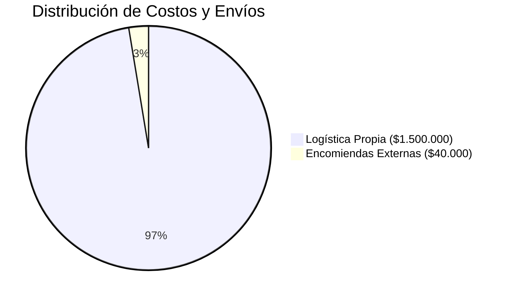

# 📊 Informe de Ahorro Logístico — Septiembre 2026

**Gestión:** Suministros y Logística- Logística.   
**Herramienta de Coordinación:** Agenda de Viajes (ClickUp)

## 

## 📈 Indicadores Clave de Desempeño (KPIs)

|Métrica|Valor|Detalles / Notas|
|-|:-:|-|
|**Ahorro Generado (Logística Propia)**|**$1.500.000**|Monto no abonado en encomiendas pagas|
|**Gasto Residual (Encomiendas)**|**$40.000**|Solo 2 envíos puntuales (10/09 y 24/09)|
|**Costo Total Estimado del Servicio**|**$1.540.000**|Valor de mercado de los 19 envíos del mes|
|**Efectividad del Ahorro**|**97.4%**|Porcentaje ahorrado sobre el costo estimado|
|**Total Bultos Transportados**|**77 bultos**|Conectores, bobinas, equipos, grampas, etc.|

## 📊 Distribución de Costos y Envíos

## 🏢 Desglose Operativo por Sucursal Destino

* **ITU (Ituzaingó):** 6 envíos (37 bultos) | **Ahorro:** $700.000 | *Gasto encomienda: $20.000*
* **ELDO (Eldorado):** 6 envíos (17 bultos) | **Ahorro:** $320.000 | *Gasto encomienda: $20.000*
* **SPD (San Pedro):** 3 envíos (15 bultos) | **Ahorro:** $300.000 | *Sin gasto externo*
* **WND (Wanda):** 4 envíos (8 bultos) | **Ahorro:** $180.000 | *Sin gasto externo*

## 

