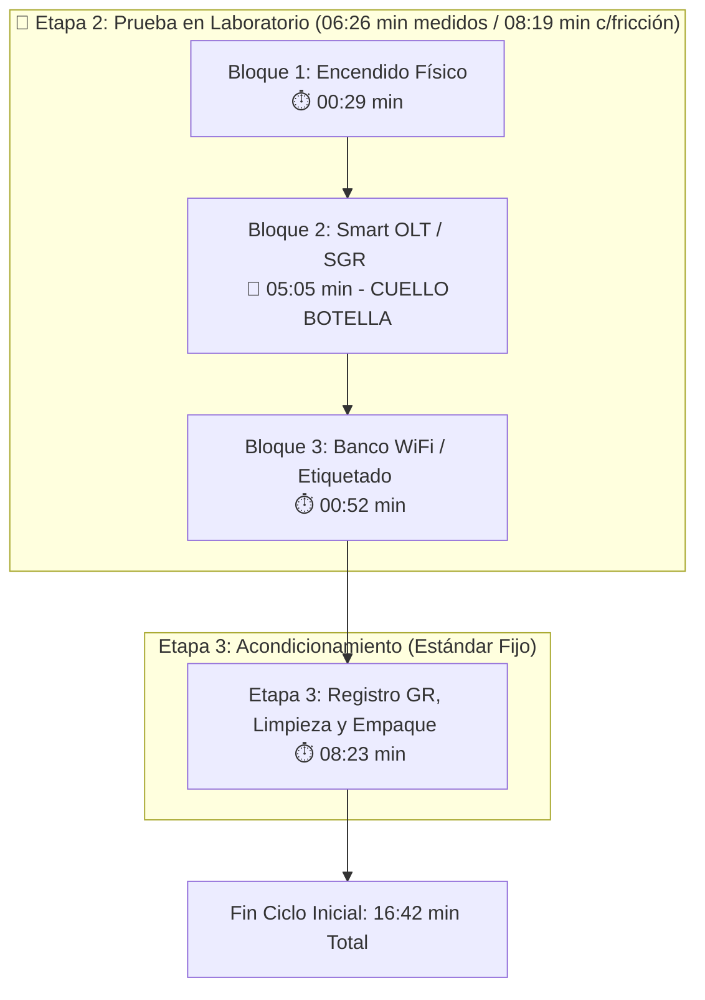
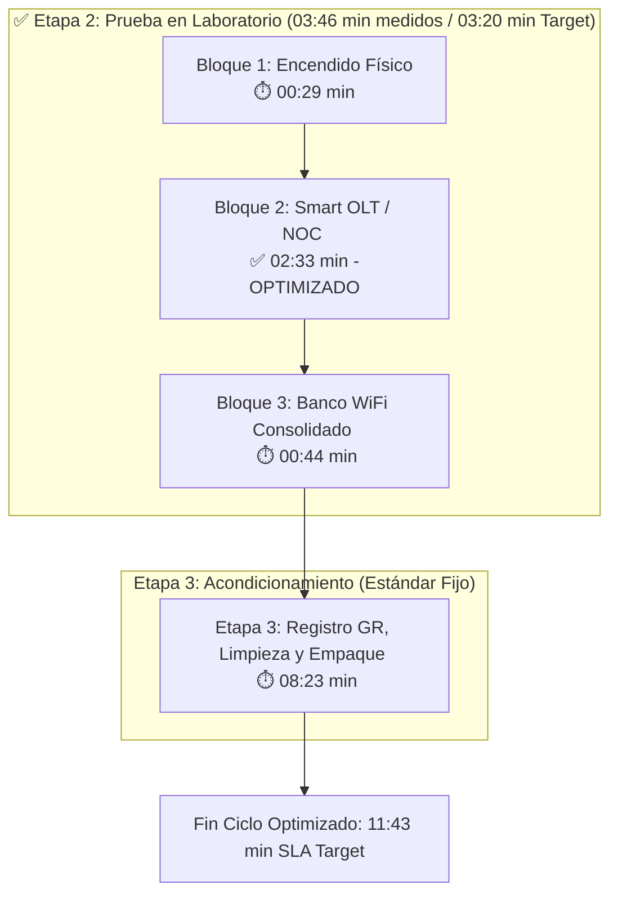

# DIAGNÓSTICO OPERATIVO: OPTIMIZACIÓN Y AUDITORÍA EN BANCO DE PRUEBAS (DIAG-ONU-001)

**Área:** Suministros y Logística - Mantenimiento de Equipos | **Familia de Equipos:** ONUs GPON CATV (ZTE F6600R) | **Estado:** Aprobado / Diagnóstico Final | **Versión:** 1.0

---

## 1. Marco Introductorio y Requisitos Previos

**Objetivo:** Diagnosticar formalmente la operación de prueba técnica, verificación física y clasificación en laboratorio de las ONUs CATV. El propósito es identificar cuellos de botella sistémicos versus ineficiencias del factor humano, estableciendo una línea base real de tiempos para la construcción del Procedimiento Operativo Estandarizado (POE).

* **Resumen Ejecutivo del Trabajo Realizado:**
    * **Metodología:** Relevamiento integral de 2.5 días bajo la modalidad de trabajo auditado en pareja.
    * **Desglose de Variables:** Discriminación entre la eficiencia del técnico y la latencia propia de las plataformas informáticas de gestión.
    * **Resultados Obtenidos:** Resolución de falla de parametrización en SmartOLT junto al área de NOC, reduciendo el aprovisionamiento lógico de **08:19 min** a **03:20 min**.
    * **Impacto Operativo:** Reducción del ciclo total de **16:42 min** a **11:43 min** (-30%), incrementando la capacidad diaria por técnico en **+46.4%** (de 28 a 41 equipos/día).

* **Insumos y Herramientas Obligatorias:**
    * **Banco de Pruebas:** Fuente de alimentación 12V / 1.5A, lápiz óptico de limpieza SC/APC, cable coaxial RG6, patch cords de fibra.
    * **Sistemas / Software:** Plataforma SmartOLT, Sistema de Gestión Real (SGR), Sistema de carga y prueba (planilla de registro), gestión TR069.
    * **EPP y Seguridad:** Guantes para limpieza y manipulación de equipos.

---

## 2. Desarrollo Técnico del Flujo Operativo

### 2.0. Contexto General del Proceso de Recupero (3 Etapas)
El procedimiento integral de recupero y reinserción de equipos en stock se compone de tres etapas correlativas:

1. **Etapa 1 - Ingreso y Registro Inicial (`01:02 min`):** Transferencia simplificada y carga inicial en el sistema de registro (constante operativa).
2. **Etapa 2 - Prueba en Laboratorio (Foco del Diagnóstico):** Secuencia técnica de encendido, aprovisionamiento lógico en SmartOLT, desvinculación en SGR y pruebas inalámbricas/ópticas.
3. **Etapa 3 - Acondicionamiento Físico y Cierre (`08:23 min`):** Proceso estandarizado de registro en GR (Artículo Usado), sanitizado profundo, inspección y empaquetado en bolsa transparente con transformador (constante física).

### Diagrama de Flujo General del Proceso

> **Delimitación Metodológica:** El presente diagnóstico concentra su análisis exclusivamente en la **Etapa 2 (Prueba en Laboratorio)**, por ser el punto de inflexión donde se intervino la arquitectura de comandos con NOC para erradicar la latencia sistémica.

---

### 2.1. Escenario Inicial ("Antes" - Con Fricción Sistémica)
En esta fase, los tiempos del banco de pruebas se encontraban severamente inflados por bloqueos y bucles de espera pasiva en las plataformas informáticas (SmartOLT y SGR).

* **Bloque 1: Encendido y Conexión Física (`00:29 min`):** Conexión eléctrica (12V/1.5A), limpieza de conector SC/APC con lápiz óptico y enrosque de coaxial RG6.
* **Bloque 2: Smart OLT / SGR - Aprovisionamiento Lógico (`05:05 min` - CUELLO DE BOTELLA):** Reemplazo de ONU, borrado de asignación lógica, resincronización de alta y eliminación manual de la interfaz PPP 1.1. **Causa de Fricción:** Bucle de comandos en SmartOLT y SGR "girando" en espera de respuesta de la OLT física.
* **Bloque 3: Banco de Pruebas / WiFi (`00:52 min`):** Test de velocidad inalámbrico, impresión/pegado de etiqueta térmica y transferencia simplificada en sistema.
* **Tiempo Medido por Suma de Bloques:** **`06:26 minutos`**. *(En jornadas de alta saturación de red, las demoras elevaban esta etapa a **`08:19 minutos`**)*.

---

### 2.2. Escenario Optimizado ("Después" - Con Intervención NOC)
Tras la intervención con el área de NOC, se optimizó la secuencia de comandos en SmartOLT y se automatizó la depuración de la interfaz PPP 1.1 mediante TR069 en simultáneo, unificando los pasos del banco.

* **Bloque 1: Encendido y Conexión Física (`00:29 min`):** Se mantiene el estándar técnico constante de conexión física.
* **Bloque 2: Smart OLT / SGR - Aprovisionamiento Lógico (`02:33 min` - OPTIMIZADO):** Ejecucción fluida de reemplazo, borrado y resincronización lógica en SmartOLT sin bucles de espera, absorbiendo la desregistración en SGR y TR069 en paralelo.
* **Bloque 3: Banco de Pruebas / WiFi (`00:44 min` - CONSOLIDADO):** Flujo unificado de lectura de potencia óptica, test de velocidad inalámbrico, etiquetado y transferencia directa.
* **Tiempo Medido por Suma de Bloques:** **`03:46 minutos`** (-41.5% de tiempo de banco). *(En condiciones óptimas de respuesta de red, el estándar target se fija en **`03:20 minutos`**)*.

---

### 2.3. Diagramas de Flujo Comparativos (Etapa 2 y Cierre de Laboratorio)

#### Escenario Inicial ("Antes")

### 2.4. Sensibilidad de Red y Comparativa de Escenarios (Etapa 2)
Para demostrar la solidez del avance logrado, se evaluó el comportamiento de la **Etapa 2** bajo distintas condiciones de respuesta del sistema[cite: 1]:

| Escenario Evaluado en Etapa 2 | Tiempo Etapa 2 | Comparativa vs. "Antes" Medido (`06:26 min`) | Comparativa vs. "Antes" Friccional (`08:19 min`) | Diagnóstico de Avance Operativo |
| :--- | :---: | :---: | :---: | :--- |
| **Mejor Escenario (SLA Target Objetivo)** | **`03:20 min`**[cite: 1] | **-48.2%** (`-03:06 min`)[cite: 1] | **-59.9%** (`-04:59 min`)[cite: 1] | Respuesta rápida del sistema y flujo continuo de comandos[cite: 1]. |
| **Escenario Medido Directo (Suma Bloques)** | **`03:46 min`**[cite: 1] | **-41.5%** (`-02:40 min`)[cite: 1] | **-54.7%** (`-04:33 min`)[cite: 1] | Tiempo promedio cronometrado durante el ensayo auditado[cite: 1]. |
| **Peor Escenario (Sistema Lento / +85% Red)** | **`05:56 min`**[cite: 1] | **-7.8%** (`-00:30 min`)[cite: 1] | **-28.7%** (`-02:23 min`)[cite: 1] | **Punto Clave:** Aun en degradación extrema de red, la mejora supera al "Antes" friccional[cite: 1]. |

> **Conclusión de Avance:** Incluso en el **Peor Escenario** (`05:56 min`)[cite: 1], el nuevo método de trabajo ahorra **`02:23 minutos` por unidad** respecto a la situación inicial con fricción (`08:19 min`)[cite: 1], demostrando que la optimización metodológica protege la operación ante caídas de la plataforma.

---

## 3. Impacto en el Ciclo Total del Laboratorio y Capacidad Diaria
Acoplando la **Etapa 3** (`08:23 min` fijos), la capacidad instalada por técnico (jornada de 8 horas) evoluciona de la siguiente manera:

* **Línea Base Inicial ("Antes" Friccional):** `16:42 min` ciclo total $\rightarrow$ **28 equipos / día**.
* **Escenario Medido ("Después" Bloques):** `12:09 min` ciclo total $\rightarrow$ **39 equipos / día** (+37.0% capacidad).
* **Mejor Escenario ("Después" SLA Target):** `11:43 min` ciclo total $\rightarrow$ **41 equipos / día** (+42.5% capacidad).

---

### 3.1 Comparativo Visual de Tiempos por Etapa

### Comparativo Visual de Tiempos Medidos por Subtarea

| Escenario | Encendido (Físico) | Smart OLT / GR (Lógico) | Pruebas WiFi / Etiquetado | Acondicionamiento y GR | Tiempo Total Medido |
| :--- | :---: | :--- | :---: | :--- | :---: |
| **ANTES** | 🟦 0:29 | 🟥🟥🟥🟥🟥 **5:05** *(Fricción OLT)* | 🟨 0:52 | 🟩🟩🟩🟩🟩🟩🟩🟩 **8:23** | **14:49 min** |
| **DESPUÉS** | 🟦 0:29 | 🟩🟩🟩 **2:33** *(Optimizado NOC)* | 🟨 0:44 | 🟩🟩🟩🟩🟩🟩🟩🟩 **8:23** | **12:09 min** |

> **Leyenda Visual:**  
> 🟦 *Conexión física* | 🟥 *Fricción sistémica en SmartOLT/GR* | 🟩 *Aprovisionamiento optimizado / Acondicionamiento* | 🟨 *Prueba inalámbrica y etiquetado*

## 4. Diagnóstico de Fricciones: Sistema vs. Factor Humano

!!! failure "Fricción Sistémica (Resuelta y Acotada)"
    **Diagnóstico:** Se confirmó que la baja producción histórica de la Etapa 2 no respondía a la actitud del operario, sino a cuellos de botella en SmartOLT y SGR que inflaban los tiempos en un **+93%** (`06:26 min` frente al target de `03:20 min` como mejor situación). Con la unificación de subtareas y el protocolo NOC, la Etapa 2 se redujo en las mediciones directas de `06:26 min` a **`03:46 min`** (-41.5%). Incluso en el peor escenario de degradación de red (`05:56 min`), el nuevo método supera a la línea base con fricción (`08:19 min`), demostrando que la optimización metodológica protege la producción ante fallas externas.

!!! warning "Factor Humano y Fricción Operativa (Bajo Control)"
    **Diagnóstico:** El acompañamiento auditado reveló que ejecutar cargas administrativas en SGR en medio de las pruebas ópticas dispersaba la atención del operario. Se fijó un estándar de **`08:23 min`** para la Etapa 3 (Acondicionamiento y Cierre), trasladando todo el empaque y registro final a esta fase estandarizada. Con la Etapa 2 optimizada (`03:20 - 03:46 min`), el ciclo completo de laboratorio se fija entre **`11:43 min`** (SLA Target) y **`12:09 min`** (Medición Directa). Cualquier desvío sostenido por encima de estos valores pasa a ser atribuible a micro-pausas, desorden en la mesa o uso del celular.

---
## 5. Conclusiones y Decisiones Estratégicas

* **1. Imposición del SLA Objetivo y Bandas de Control:** Se fija formalmente como norma de laboratorio un **SLA Target de 11:43 minutos** por unidad (comprendido por `03:20 min` en Etapa 2 y `08:23 min` en Etapa 3). Para el monitoreo operativo continuo, se establece una banda de tolerancia basada en la medición directa de subtareas de **12:09 minutos por equipo**.
* **2. Protocolo de Escalamiento Inmediato a NOC:** Queda estrictamente prohibido que el técnico permanezca en espera pasiva ante bloqueos del sistema. Si la ejecución de un comando en SmartOLT supera los **45 segundos en bucle**, el técnico debe abrir un ticket inmediato a NOC y pasar al diagnóstico del siguiente equipo.
* **3. Respaldo Técnico para RRHH y Matriz de Producción:** El informe proporciona evidencia cuantitativa para auditar planillas según la velocidad de la red. La capacidad instalada por técnico (jornada de 8 horas / 480 minutos) se establece en:
  * **SLA Target (`11:43 min`):** **5.1 equipos/hora** $\rightarrow$ **41 equipos/día**.
  * **Medición Directa (`12:09 min`):** **4.9 equipos/hora** $\rightarrow$ **39-40 equipos/día**.
  * **Peor Escenario - Red Lenta (`14:19 min`):** **4.2 equipos/hora** $\rightarrow$ **33-34 equipos/día** (piso mínimo garantizado).
  * **Línea Base Anterior - Con Fricción (`16:42 min`):** **3.6 equipos/hora** $\rightarrow$ **28-29 equipos/día**.
* **4. Transferibilidad a Sucursales y Saneamiento de Stock:** La estructura estandarizada en 3 Etapas (`Ingreso`: 01:02 min, `Prueba`: 03:20 min, `Acondicionamiento`: 08:23 min) constituye el insumo principal para el POE definitivo. Esto permitirá replicar la metodología en las sedes regionales sin personal dedicado, garantizando que el stock transferido a los almacenes Principal y Devoluciones sea 100% certero.

---
## Anexo A: Reevaluación de Tiempos Medidos por Bloque (Justificación de Datos)

A continuación se presenta la matriz detallada que respalda el consolidado numérico de la **Etapa 2**, mostrando la evolución exacta de cada subproceso unificado[cite: 1]:

| Bloque Operativo | Subtareas Unificadas en la Medición | Tiempo "Antes" | Tiempo "Después" | Variación Absoluta | % de Ahorro |
| :--- | :--- | :---: | :---: | :---: | :---: |
| **Bloque 1: Encendido** | Enchufar transformador 12V/1.5A + Limpiar conector SC/APC con lápiz óptico + Enroscar RG6[cite: 1]. | `00:29 min`[cite: 1] | `00:29 min`[cite: 1] | `00:00 min`[cite: 1] | **0.0%**[cite: 1] |
| **Bloque 2: Smart OLT / GR** | Reemplazo de ONU + Eliminar asignación + Resincronización lógica + Desregistro SGR + Depuración PPP 1.1 vía TR069[cite: 1]. | `05:05 min`[cite: 1] | `02:33 min`[cite: 1] | `-02:32 min`[cite: 1] | **-49.8%**[cite: 1] |
| **Bloque 3: Banco WiFi / Etiquetado** | Copiar potencia óptica + Test de velocidad inalámbrico + Impresión/pegado etiqueta térmica + Transferencia simplificada[cite: 1]. | `00:52 min`[cite: 1] | `00:44 min`[cite: 1] | `-00:08 min`[cite: 1] | **-15.4%**[cite: 1] |
| **TOTAL ETAPA 2** | **Suma Directa de Bloques Cronometrados en Banco** | **`06:26 min`**[cite: 1] | **`03:46 min`**[cite: 1] | **`-02:40 min`**[cite: 1] | **-41.5%**[cite: 1] |

## 6. Historial de Control de Cambios

| Versión | Fecha | Descripción de la Modificación | Autor |
| :--- | :--- | :--- | :--- |
| 0.1 | 16/08/2026 | Medición inicial con fricción de sistema (16:42 min total). | Auditoría de Laboratorio |
| 1.0 | 16/08/2026 | Optimización de SmartOLT c/NOC y fijación de SLA (11:43 min total). | Jefatura de Depósito / S&L |
