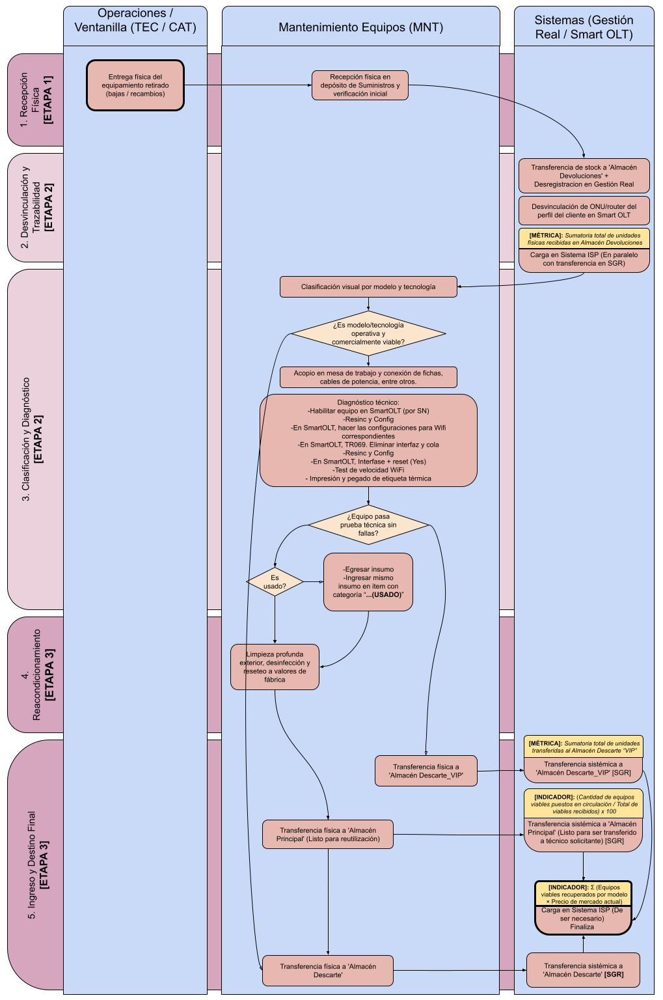
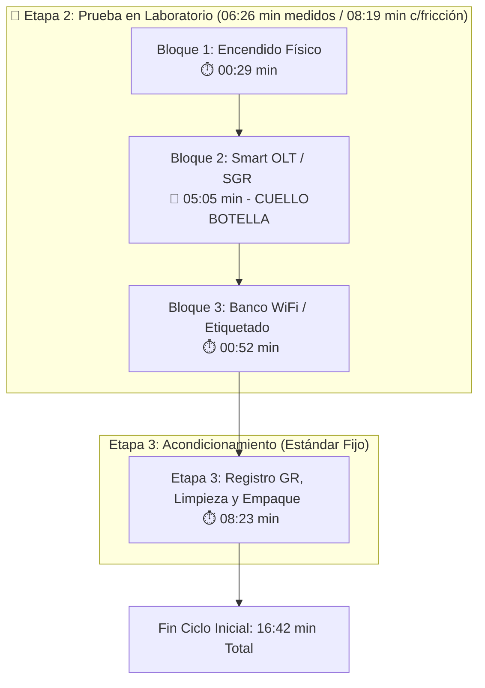
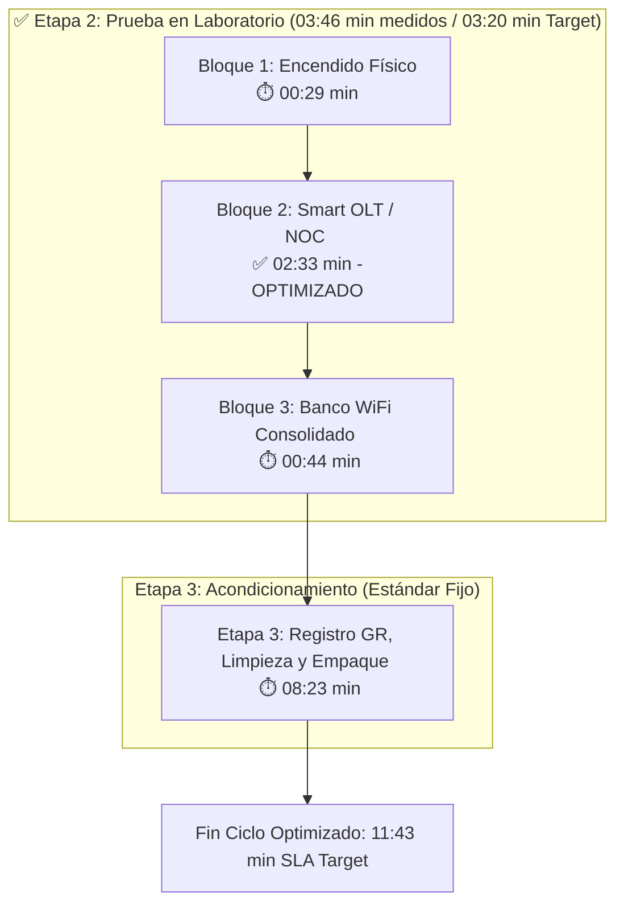

# DIAGNÓSTICO OPERATIVO: OPTIMIZACIÓN Y AUDITORÍA EN BANCO DE PRUEBAS (DIAG-ONU-001)

**Área:** Suministros y Logística - Mantenimiento de Equipos | **Familia de Equipos:** ONUs GPON CATV (ZTE F6600R) | **Estado:** Aprobado / Diagnóstico Final | **Versión:** 1.0

---

## 1. Marco Introductorio y Requisitos Previos

**Objetivo:** Diagnosticar formalmente la operación de prueba técnica, verificación física y clasificación en laboratorio de las ONUs CATV (ZTE F6600R). El propósito es identificar cuellos de botella sistémicos versus ineficiencias del factor humano, estableciendo una línea base real de tiempos para la construcción del Procedimiento Operativo Estandarizado (POE).

* **Resumen Ejecutivo del Trabajo Realizado:**
    * **Metodología:** Relevamiento integral de 2.5 días bajo la modalidad de trabajo auditado en pareja.
    * **Desglose de Variables:** Discriminación entre la eficiencia propia del técnico y la latencia generada por la infraestructura de software.
    * **Resultados Obtenidos:** Optimización de la secuencia de comandos en SmartOLT y automatización de la interfaz PPP 1.1 vía TR069 junto a NOC, reduciendo el tiempo de la Etapa 2 (Pruebas en Banco) de `08:19 min` (friccional) a **`03:20 min`** (SLA Target), y de `06:26 min` a **`03:46 min`** en medición directa por subtareas (-41.5%).
    * **Impacto Operativo (Ciclo de Laboratorio - Etapas 2 y 3):** Reducción del ciclo total de **16:42 min** a **11:43 min** (-29.8% $\approx -30\%$), incrementando la capacidad diaria instalada por técnico de **28 a 41 equipos/día** (+42.5% exacto / +46.4% sobre enteros redondeados). *(Suma de las 3 Etapas unificadas: de 17:44 min a 12:45 min / 27 a 38 equipos/día)*.

* **Insumos y Herramientas Obligatorias:**
    * **Banco de Pruebas:** Fuente de alimentación 12V / 1.5A, lápiz óptico de limpieza SC/APC, cable coaxial RG6, patch cords de fibra óptica y lector/escáner de código de barras.
    * **Sistemas / Software:** Plataforma SmartOLT, Sistema de Gestión Real (SGR), Sistema de carga y prueba (ISP / planilla de registro) y gestión TR069.
    * **EPP y Seguridad:** Guantes de protección para limpieza, desinfección y manipulación de equipos.

---

## 2. Desarrollo Técnico del Flujo Operativo

### 2.0. Contexto General del Proceso de Recupero (3 Etapas)
El procedimiento integral de recupero y reinserción de equipos en stock se compone de tres etapas correlativas:

1. **Etapa 1 - Ingreso y Registro Inicial (`01:02 min`):** Transferencia simplificada y carga inicial en el sistema de registro (constante operativa).
2. **Etapa 2 - Prueba en Laboratorio (Foco del Diagnóstico):** Secuencia técnica de encendido, aprovisionamiento lógico en SmartOLT, desvinculación en SGR y pruebas inalámbricas/ópticas.
3. **Etapa 3 - Acondicionamiento Físico y Cierre (`08:23 min`):** Proceso estandarizado de registro en GR (Artículo Usado), sanitizado profundo, inspección y empaquetado en bolsa transparente con transformador (constante física).

### Diagrama de Flujo General del Proceso

> **Delimitación Metodológica:** El presente diagnóstico concentra su análisis exclusivamente en la **Etapa 2 (Prueba en Laboratorio)**, por ser el punto de inflexión donde se intervino la arquitectura de comandos con NOC para erradicar la latencia sistémica.

---

### 2.1. Escenario Inicial ("Antes" - Con Fricción Sistémica)
En esta fase, los tiempos del banco de pruebas se encontraban severamente inflados por bloqueos y bucles de espera pasiva en las plataformas informáticas (SmartOLT y SGR).

---

### 2.2. Escenario Optimizado ("Después" - Con Intervención NOC)
Tras la intervención con el área de NOC, se optimizó la secuencia de comandos en SmartOLT y se automatizó la depuración de la interfaz PPP 1.1 mediante TR069 en simultáneo, unificando los pasos del banco.

### 2.3. Sensibilidad de Red y Comparativa de Escenarios (Etapa 2)
Para demostrar la solidez del avance logrado, se evaluó el comportamiento de la **Etapa 2** bajo distintas condiciones de respuesta del sistema:

| Escenario Evaluado en Etapa 2 | Tiempo Etapa 2 | Comparativa vs. "Antes" Medido (`06:26 min`) | Comparativa vs. "Antes" Friccional (`08:19 min`) | Diagnóstico de Avance Operativo |
| :--- | :---: | :---: | :---: | :--- |
| **Mejor Escenario (SLA Target Objetivo)** | **`03:20 min`** | **-48.2%** (`-03:06 min`) | **-59.9%** (`-04:59 min`) | Respuesta rápida del sistema y flujo continuo de comandos. |
| **Escenario Medido Directo (Suma Bloques)** | **`03:46 min`** | **-41.5%** (`-02:40 min`) | **-54.7%** (`-04:33 min`) | Tiempo promedio cronometrado durante el ensayo auditado. |
| **Peor Escenario (Sistema Lento / +85% Red)** | **`05:56 min`** | **-7.8%** (`-00:30 min`) | **-28.7%** (`-02:23 min`) | **Punto Clave:** Aun en degradación extrema de red, la mejora supera al "Antes" friccional. |

> **Conclusión de Avance:** Incluso en el **Peor Escenario** (`05:56 min`), el nuevo método de trabajo ahorra **`02:23 minutos` por unidad** respecto a la situación inicial con fricción (`08:19 min`), demostrando que la optimización metodológica protege la operación ante caídas de la plataforma.

---

## 3. Impacto en el Ciclo Total del Laboratorio y Capacidad Diaria

Acoplando las **3 Etapas del Proceso** (`Etapa 1 - Ingreso`: 01:02 min, `Etapa 2 - Prueba`: variable según respuesta del sistema, y `Etapa 3 - Acondicionamiento`: 08:23 min fijos), la capacidad instalada equivalente por técnico (jornada laboral de 8 horas / 480 minutos) evoluciona de la siguiente manera:

* **Línea Base Inicial ("Antes" Friccional):** `17:44 min` ciclo total (`01:02` + `08:19` + `08:23`) $\rightarrow$ **27 equipos / día** (3.4 eq/hora).
* **Peor Escenario ("Después" Red Lenta):** `15:21 min` ciclo total (`01:02` + `05:56` + `08:23`) $\rightarrow$ **31 equipos / día** (+15.5% capacidad / 3.9 eq/hora).
* **Escenario Medido Directo (Suma Subtareas):** `13:11 min` ciclo total (`01:02` + `03:46` + `08:23`) $\rightarrow$ **36 equipos / día** (+34.5% capacidad / 4.6 eq/hora).
* **Mejor Escenario ("Después" SLA Target):** `12:45 min` ciclo total (`01:02` + `03:20` + `08:23`) $\rightarrow$ **38 equipos / día** (+39.1% capacidad / 4.7 eq/hora).

> **Aclaración Metodológica:** Las tres etapas pueden ejecutarse de forma independiente y secuencial. Los valores expuestos representan el **tiempo de ciclo equivalente por unidad individual** para completar el flujo completo de reinserción. En la práctica operativa, la ejecución por **lotes de equipos** permite amortizar tiempos de traslado y maximizar el rendimiento general del laboratorio.

---

### 3.1. Comparativo Visual de Tiempos Medidos por Subtarea (3 Etapas)

| Escenario | Ingreso y Registro (Etapa 1) | Encendido (Físico) | Smart OLT / GR (Lógico) | Pruebas WiFi / Etiquetado | Acondicionamiento y GR (Etapa 3) | Tiempo Total Medido (3 Etapas) |
| :--- | :---: | :---: | :--- | :---: | :--- | :---: |
| **ANTES** | 🟪 1:02 | 🟦 0:29 | 🟥🟥🟥🟥🟥 **5:05** *(Fricción OLT)* | 🟨 0:52 | 🟩🟩🟩🟩🟩🟩🟩🟩 **8:23** | **15:51 min** |
| **DESPUÉS** | 🟪 1:02 | 🟦 0:29 | 🟩🟩🟩 **2:33** *(Optimizado NOC)* | 🟨 0:44 | 🟩🟩🟩🟩🟩🟩🟩🟩 **8:23** | **13:11 min** |

> **Leyenda Visual:**  
> 🟪 *Ingreso y registro inicial* | 🟦 *Conexión física* | 🟥 *Fricción sistémica en SmartOLT/GR* | 🟩 *Aprovisionamiento optimizado / Acondicionamiento* | 🟨 *Prueba inalámbrica y etiquetado*

---

## 4. Diagnóstico de Fricciones: Sistema vs. Factor Humano

!!! failure "Fricción Sistémica (Resuelta y Acotada)"
    **Diagnóstico:** Se confirmó que la baja producción histórica de la Etapa 2 no respondía a la actitud del operario, sino a cuellos de botella en SmartOLT y SGR que inflaban los tiempos en un **+93%** (`06:26 min` frente al target de `03:20 min` como mejor situación). Con la unificación de subtareas y el protocolo NOC, la Etapa 2 se redujo en las mediciones directas de `06:26 min` a **`03:46 min`** (-41.5%). Incluso en el peor escenario de degradación de red (`05:56 min`), el nuevo método supera a la línea base con fricción (`08:19 min`), demostrando que la optimización metodológica protege la producción ante fallas externas.

!!! warning "Factor Humano y Fricción Operativa (Bajo Control)"
    **Diagnóstico:** El acompañamiento auditado reveló que ejecutar cargas administrativas en SGR en medio de las pruebas ópticas dispersaba la atención del operario. Se fijó un estándar de **`08:23 min`** para la Etapa 3 (Acondicionamiento y Cierre), trasladando todo el empaque y registro final a esta fase estandarizada. Con la Etapa 2 optimizada (`03:20 - 03:46 min`), el ciclo completo de las 3 Etapas se fija entre **`12:45 min`** (SLA Target) y **`13:11 min`** (Medición Directa). Cualquier desvío sostenido por encima de estos valores pasa a ser atribuible a micro-pausas, desorden en la mesa o uso del celular.

---

## 5. Conclusiones y Decisiones Estratégicas

* **1. Imposición del SLA Objetivo y Bandas de Control:** Se fija formalmente como norma de proceso un **SLA Target de 12:45 minutos** por unidad (comprendido por `01:02 min` en Etapa 1, `03:20 min` en Etapa 2 y `08:23 min` en Etapa 3). Para el monitoreo operativo continuo, se establece una banda de tolerancia basada en la medición directa de subtareas de **13:11 minutos por equipo**.
* **2. Protocolo de Escalamiento Inmediato a NOC:** Queda strictly prohibido que el técnico permanezca en espera pasiva ante bloqueos del sistema. Si la ejecución de un comando en SmartOLT supera los **45 segundos en bucle**, el técnico debe abrir un ticket inmediato a NOC y pasar al diagnóstico del siguiente equipo.
* **3. Respaldo Técnico para RRHH y Matriz de Producción:** El informe proporciona evidencia cuantitativa para auditar planillas según la velocidad de la red. La capacidad instalada equivalente por técnico (jornada de 8 horas / 480 minutos) para el proceso completo de 3 Etapas se establece en:
  * **SLA Target (`12:45 min`):** **4.7 equipos/hora** $\rightarrow$ **38 equipos/día**.
  * **Medición Directa (`13:11 min`):** **4.6 equipos/hora** $\rightarrow$ **36 equipos/día**.
  * **Peor Escenario - Red Lenta (`15:21 min`):** **3.9 equipos/hora** $\rightarrow$ **31 equipos/día** (piso mínimo garantizado).
  * **Línea Base Anterior - Con Fricción (`17:44 min`):** **3.4 equipos/hora** $\rightarrow$ **27 equipos/día**.
* **4. Transferibilidad a Sucursales y Saneamiento de Stock:** La estructura estandarizada en 3 Etapas (`Ingreso`: 01:02 min, `Prueba`: 03:20 min, `Acondicionamiento`: 08:23 min) constituye el insumo principal para el POE definitivo. Esto permitiria replicar la metodología en las sedes regionales sin personal dedicado, garantizando que el stock transferido a los almacenes Principal y Devoluciones sea 100% certero.

---
## Anexo A: Matriz Completa de Tiempos y Procesos de Reinserción

Matriz consolidada de tiempos por etapa y subtarea para el procedimiento integral de recupero y reinserción de equipos ONU/Router CATV:

| Etapa del Proceso | Proceso / Bloque | Subtareas Unificadas | Tiempo "Antes" | Tiempo "Después" | Observaciones y Descripción Técnica |
| :--- | :--- | :--- | :---: | :---: | :--- |
| **1) Ingreso** | **Registro Inicial** | Ubicación en SGR + Carga de datos en ISP | `01:02 min` | `01:02 min` | Escaneo en ALMACÉN y registro de S/N, modelo y responsable de devolución. |
| **2) Prueba en Laboratorio** | **Encendido** | Conexión eléctrica, fibra óptica y RG6 | `00:29 min` | `00:29 min` | Conexión a fuente 12V/1.5A, limpieza SC/APC y enrosque coaxial RG6. |
| | **Smart OLT / GR** | Reemplazo, borrado, resincronización y TR069 | `05:05 min` | `02:33 min` | En "Antes" sufría bucles por respuesta de la OLT. Optimizado por método NOC. |
| | **Banco WiFi / Etiqueta** | Potencia óptica, test WiFi, etiqueta y transferencia | `00:52 min` | `00:44 min` | Medición de potencia, prueba inalámbrica, etiquetado y derivación a almacén. |
| **SUBTOTAL ETAPA 2** | **Prueba en Banco** | **Suma Directa Medida (Laboratorio)** | **`06:26 min`** | **`03:46 min`** | **Optimización del -41.5% (-02:40 min de trabajo técnico en banco).** |
| *Ref. Escenarios Etapa 2* | *Rango de Respuesta* | *SLA Target Objetivo / Red Lenta (+85%)* | *`08:19 min` (Fricción)* | *`03:20 min` (Target)* | *Piso mínimo garantizado con red lenta: `05:56 min`.* |
| **3) Acondicionamiento** | **Sistema y Físico** | Carga USADO en SGR + Limpieza + Empaquetado | `08:23 min` | `08:23 min` | Cambio de estado en GR, sanitizado de chasis y embolsado c/transformador. |
| **CICLO COMPLETO** | **3 Etapas Unificadas** | **Total Proceso Individual Equivalente** | **`15:51 min`** | **`13:11 min`** | **Ahorro neto de -02:40 min por unidad en el flujo integral (36 equipos/día).** |

### Historial de Control de Cambios

| Versión | Fecha | Descripción de la Modificación | Autor |
| :--- | :--- | :--- | :--- |
| **0.1** | 16/08/2026 | Medición inicial con fricción de sistema (`16:42 min` ciclo laboratorio / `08:19 min` Etapa 2). | Auditoría de Laboratorio |
| **0.2** | 16/08/2026 | Desglose en 3 Etapas independientes y unificación de subtareas por bloques funcionales (`06:26 min` medido en Etapa 2). | Jefatura de Depósito / S&L |
| **1.0** | 17/08/2026 | Optimización de SmartOLT c/NOC, automatización TR069 y fijación de SLA Target (`11:43 min` ciclo / `03:20 min` Etapa 2). | Jefatura de Depósito / S&L |
