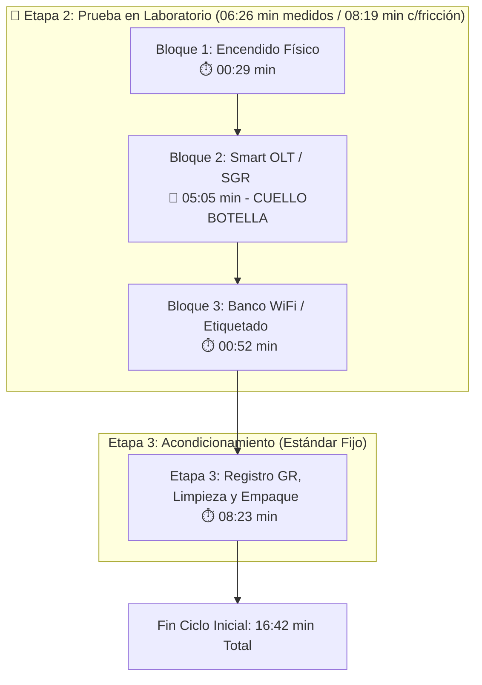
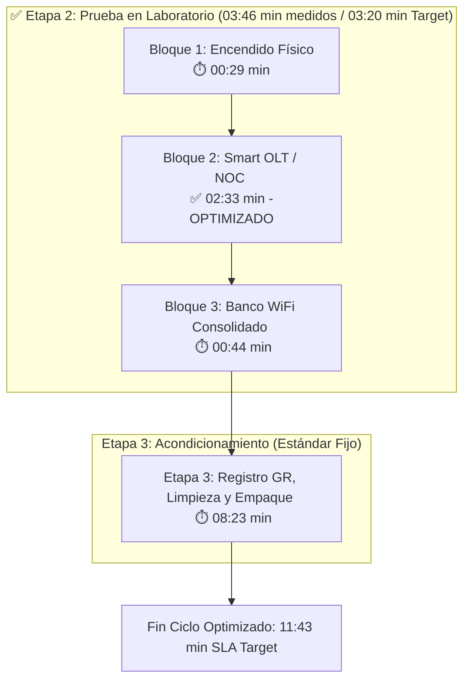

# DIAGNÓSTICO OPERATIVO: OPTIMIZACIÓN Y AUDITORÍA EN BANCO DE PRUEBAS (DIAG-ONU-001)

**Área:** Suministros y Logística - Mantenimiento de Equipos | **Familia de Equipos:** ONUs GPON CATV (ZTE F6600R) | **Estado:** Aprobado / Diagnóstico Final | **Versión:** 1.0

---

## 1. Marco Introductorio y Requisitos Previos

**Objetivo:** Diagnosticar formalmente la operación de prueba técnica, verificación física y clasificación en laboratorio de las ONUs CATV. El propósito es identificar cuellos de botella sistémicos versus ineficiencias del factor humano, estableciendo una línea base real de tiempos para la construcción del Procedimiento Operativo Estandarizado (POE).

* **Resumen Ejecutivo del Trabajo Realizado:**
    * **Metodología:** Relevamiento integral de 2.5 días bajo la modalidad de trabajo auditado en pareja.
    * **Desglose de Variables:** Discriminación entre la eficiencia del técnico y la latencia propia de las plataformas informáticas de gestión.
    * **Resultados Obtenidos:** Resolución de falla de parametrización en SmartOLT junto al área de NOC, reduciendo el aprovisionamiento lógico de **08:19 min** a **03:20 min**.
    * **Impacto Operativo:** Reducción del ciclo total de **16:42 min** a **11:43 min** (-30%), incrementando la capacidad diaria por técnico en **+46.4%** (de 28 a 41 equipos/día).

* **Insumos y Herramientas Obligatorias:**
    * **Banco de Pruebas:** Fuente de alimentación 12V / 1.5A, lápiz óptico de limpieza SC/APC, cable coaxial RG6, patch cords de fibra.
    * **Sistemas / Software:** Plataforma SmartOLT, Sistema de Gestión Real (SGR), Sistema de carga y prueba (planilla de registro), gestión TR069.
    * **EPP y Seguridad:** Guantes para limpieza y manipulación de equipos.

---

## 2. Desarrollo Técnico del Flujo Operativo

### 2.0. Contexto General del Proceso de Recupero (3 Etapas)
El procedimiento integral de recupero y reinserción de equipos en stock se compone de tres etapas correlativas:

1. **Etapa 1 - Ingreso y Registro Inicial (`01:02 min`):** Transferencia simplificada y carga inicial en el sistema de registro (constante operativa).
2. **Etapa 2 - Prueba en Laboratorio (Foco del Diagnóstico):** Secuencia técnica de encendido, aprovisionamiento lógico en SmartOLT, desvinculación en SGR y pruebas inalámbricas/ópticas.
3. **Etapa 3 - Acondicionamiento Físico y Cierre (`08:23 min`):** Proceso estandarizado de registro en GR (Artículo Usado), sanitizado profundo, inspección y empaquetado en bolsa transparente con transformador (constante física).

> **Delimitación Metodológica:** El presente diagnóstico concentra su análisis exclusivamente en la **Etapa 2 (Prueba en Laboratorio)**, por ser el punto de inflexión donde se intervino la arquitectura de comandos con NOC para erradicar la latencia sistémica.

---

### 2.1. Escenario Inicial ("Antes" - Con Fricción Sistémica)
En esta fase, los tiempos del banco de pruebas se encontraban severamente inflados por bloqueos y bucles de espera pasiva en las plataformas informáticas (SmartOLT y SGR).

* **Bloque 1: Encendido y Conexión Física (`00:29 min`):** Conexión eléctrica (12V/1.5A), limpieza de conector SC/APC con lápiz óptico y enrosque de coaxial RG6.
* **Bloque 2: Smart OLT / SGR - Aprovisionamiento Lógico (`05:05 min` - CUELLO DE BOTELLA):** Reemplazo de ONU, borrado de asignación lógica, resincronización de alta y eliminación manual de la interfaz PPP 1.1. **Causa de Fricción:** Bucle de comandos en SmartOLT y SGR "girando" en espera de respuesta de la OLT física.
* **Bloque 3: Banco de Pruebas / WiFi (`00:52 min`):** Test de velocidad inalámbrico, impresión/pegado de etiqueta térmica y transferencia simplificada en sistema.
* **Tiempo Medido por Suma de Bloques:** **`06:26 minutos`**. *(En jornadas de alta saturación de red, las demoras elevaban esta etapa a **`08:19 minutos`**)*.

---

### 2.2. Escenario Optimizado ("Después" - Con Intervención NOC)
Tras la intervención con el área de NOC, se optimizó la secuencia de comandos en SmartOLT y se automatizó la depuración de la interfaz PPP 1.1 mediante TR069 en simultáneo, unificando los pasos del banco.

* **Bloque 1: Encendido y Conexión Física (`00:29 min`):** Se mantiene el estándar técnico constante de conexión física.
* **Bloque 2: Smart OLT / SGR - Aprovisionamiento Lógico (`02:33 min` - OPTIMIZADO):** Ejecucción fluida de reemplazo, borrado y resincronización lógica en SmartOLT sin bucles de espera, absorbiendo la desregistración en SGR y TR069 en paralelo.
* **Bloque 3: Banco de Pruebas / WiFi (`00:44 min` - CONSOLIDADO):** Flujo unificado de lectura de potencia óptica, test de velocidad inalámbrico, etiquetado y transferencia directa.
* **Tiempo Medido por Suma de Bloques:** **`03:46 minutos`** (-41.5% de tiempo de banco). *(En condiciones óptimas de respuesta de red, el estándar target se fija en **`03:20 minutos`**)*.

---

### 2.3. Diagramas de Flujo Comparativos (Etapa 2 y Cierre de Laboratorio)

#### Escenario Inicial ("Antes")

## 3. Matriz Comparativa de Tiempos y Capacidad

| Etapa / Bloque del Proceso | Escenario Inicial ("Antes") | Escenario Optimizado ("Después") | Variación Absoluta | Variación Porcentual |
| :--- | :---: | :---: | :---: | :---: |
| **Bloque A:** Recepción y Conexión Física | 00:51 min | 00:51 min | 00:00 min | 0.0% |
| **Bloque B:** Carga y Aprovisionamiento Lógico | **08:19 min** | **03:20 min** | **-04:59 min** | **-60.0%** |
| **Bloque C:** Pruebas Operativas y Etiquetado | 00:44 min | 00:44 min | 00:00 min | 0.0% |
| **Bloque D:** Acondicionamiento Físico y GR | 08:23 min | 08:23 min | 00:00 min | 0.0% |
| **TIEMPO TOTAL POR UNIDAD** | **16:42 min** | **11:43 min** | **-04:59 min** | **-29.8%** |
| **CAPACIDAD DIARIA TEÓRICA (Jornada 8h)** | **28 equipos / día** | **41 equipos / día** | **+13 equipos** | **+46.4%** |

### Comparativo Visual de Tiempos por Etapa

| Escenario | Bloque A (Conexión) | Bloque B (SmartOLT / SGR) | Bloque C (WiFi) | Bloque D (Acondicionado) | Tiempo Total |
| :--- | :---: | :--- | :---: | :--- | :---: |
| **ANTES** | 🟦 0:51 | 🟥🟥🟥🟥🟥🟥🟥🟥 **8:19** *(Fricción)* | 🟨 0:44 | 🟩🟩🟩🟩🟩🟩🟩🟩 **8:23** | **16:42 min** |
| **DESPUÉS** | 🟦 0:51 | 🟩🟩🟩 **3:20** *(Optimizado NOC)* | 🟨 0:44 | 🟩🟩🟩🟩🟩🟩🟩🟩 **8:23** | **11:43 min** |

> **Leyenda Visual:**  
> 🟦 *Conexión física* | 🟥 *Cuello de botella sistémico* | 🟩 *Proceso optimizado / Acondicionamiento* | 🟨 *Prueba inalámbrica*

## 4. Diagnóstico de Fricciones: Sistema vs. Factor Humano

!!! failure "Fricción Sistémica (Resuelta)"
    **Diagnóstico:** Se confirmó que la baja producción histórica no respondía únicamente a la actitud del trabajador. Las demoras en la respuesta de las plataformas SmartOLT y SGR llegaban a inflar el tiempo de prueba en hasta un **85% adicional**. Sin la intervención con NOC, el técnico quedaba atado a un bucle de espera sin posibilidad de acelerar el trabajo.

!!! warning "Factor Humano y Fricción Operativa (Bajo Control)"
    **Diagnóstico:** El acompañamiento auditado reveló que realizar cargas administrativas en el sistema SGR en medio de las pruebas ópticas dispersaba la atención del operario. Se ordenó trasladar todo el empaque y registro en SGR al final del ciclo (Bloque D), fijando un estándar de **08:23 min**. Con la plataforma optimizada, cualquier demora superior a los 11:43 min totales pasa a ser atribuible a micro-pausas, desorden en la mesa o uso del celular.

## 5. Conclusiones y Decisiones Estratégicas

* **1. Imposición del SLA Objetivo:** Se fija formalmente como norma de laboratorio un tiempo límite de **11:43 minutos por equipo CATV**. Esta métrica servirá de base para auditar la productividad diaria del personal.
* **2. Protocolo de Escalamiento a NOC:** Queda prohibido que el técnico permanezca esperando la respuesta pasiva del sistema. Si un comando en SmartOLT supera los **45 segundos en bucle**, se debe abrir un ticket inmediato a NOC.
* **3. Respaldo Técnico para RRHH:** El informe proporciona evidencia cuantitativa y objetiva para desestimar excusas operativas sobre las planillas diarias, permitiendo exigir un rendimiento acorde a la nueva capacidad instalada (**41 equipos/día**).
* **4. Transferibilidad a Sucursales y Stock:** Este diagnóstico constituye el insumo principal para redactar el POE definitivo que se extrapolará a las sucursales sin personal exclusivo de prueba, asegurando que los dos almacenes auditados (Principal y Devoluciones) mantengan un registro de stock 100% certero.

## 6. Historial de Control de Cambios

| Versión | Fecha | Descripción de la Modificación | Autor |
| :--- | :--- | :--- | :--- |
| 0.1 | 16/08/2026 | Medición inicial con fricción de sistema (16:42 min total). | Auditoría de Laboratorio |
| 1.0 | 16/08/2026 | Optimización de SmartOLT c/NOC y fijación de SLA (11:43 min total). | Jefatura de Depósito / S&L |
