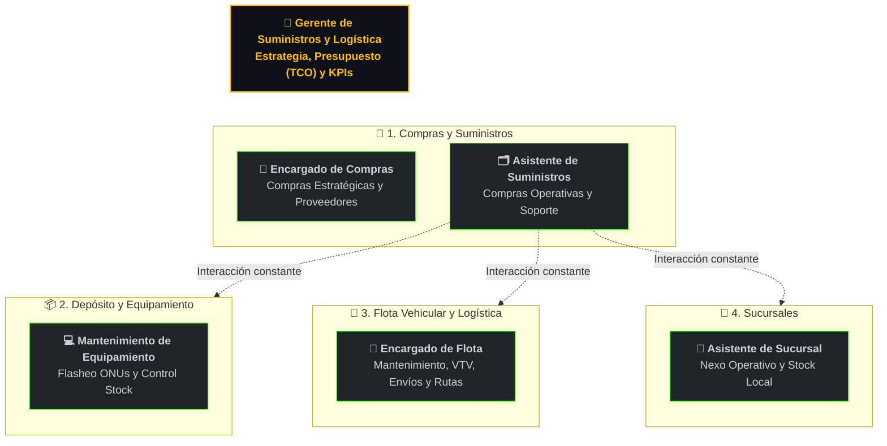

# 🏢 Área de Suministros y Logística (S&L)

!!! abstract "Nuestra Razón de Ser"
    El área de **Suministros y Logística (S&L)** de Obercom tiene como misión principal garantizar la continuidad operativa y sostener la expansión de nuestra red de telecomunicaciones al menor **Costo Total de Propiedad (TCO)**. 
    
    Somos el motor logístico de la empresa: aseguramos que nuestros equipos de campo y sucursales siempre tengan los materiales que necesitan, en el momento y lugar correctos, optimizando los recursos y protegiendo el capital de la organización.

---

## 🗺️ Mapa Operativo y Estructura de Roles

A continuación, se detalla la estructura organizativa del área, liderada por la Gerencia y dividida en tres grandes verticales operativas mas el vinvulo intersucursal.

## ⚙️ Campos de Acción por Sub-Vertical Operativa

### 👑 Liderazgo y Dirección General
* **Roles Asignados:** Gerente de Suministros y Logística.
* **Campo de Acción:**
    * Planificación estratégica del área, definición de objetivos y alineación operacional con la Dirección General.
    * Gestión presupuestaria global y control del Costo Total de Propiedad (TCO).
    * Monitoreo y reporte de indicadores clave de desempeño (KPIs) ante la Gerencia.
    * Gestión preventiva de riesgos operativos en la cadena de suministro para evitar quiebres de stock o cuellos de botella.

### 🛒 1. Compras y Suministros
* **Roles Asignados:** Encargado de Compras | Asistente de Suministros.
* **Campo de Acción:**
    * Búsqueda de precios, negociación comercial con proveedores y análisis comparativo de presupuestos.
    * Desarrollo, calificación y auditoría continua del Padrón de Proveedores Calificados.
    * Adquisición de insumos estratégicos y de alta criticidad (fibra óptica, ONUs, equipamiento de red GPON).
    * Ejecución de compras operativas cotidianas (ferretería, insumos menores, compras web) y soporte administrativo a Finanzas.
    * Gestión de retiros locales de materiales en puntos comerciales.

### 📦 2. Mantenimiento del Equipamiento y Depósito
* **Roles Asignados:** Mantenimiento del Equipamiento | Asistente de Suministros (Soporte).
* **Campo de Acción:**
    * Inspección física, diagnóstico de hardware, limpieza, reparación básica y flasheo/actualización de firmware en ONUs y routers devueltos.
    * Conciliación permanente entre el inventario físico del almacén central y los registros en sistemas (SGR / SmartOLT).
    * Ejecución de auditorías cruzadas de inventario en los depósitos de la red de sucursales.
    * Preparación y despacho de kits de materiales diarios para la cuadrilla técnica de calle.
    * Auditoría periódica de las herramientas e insumos a bordo de las unidades móviles.

### 🚚 3. Flota Vehicular y Logística
* **Roles Asignados:** Encargado de Vehículos (Flota y Coordinación) | Asistente de Suministros (Soporte).
* **Campo de Acción:**
    * Planificación y seguimiento del mantenimiento preventivo y correctivo de las unidades móviles con talleres homologados.
    * Control documental de la flota (VTV, pólizas de seguro, licencias habilitantes, impuestos y multas).
    * Inspección diaria mediante Checklist de estado físico/mecánico y de seguridad al inicio y cierre de turnos.
    * Auditoría del consumo de combustible por unidad (KPL) y asignación ordenada de vehículos por técnico.
    * Planificación y programación de hojas de ruta para viajes inter-sucursales (traslado de insumos y equipos).
    * Gestión y despacho de envíos mediante transportes externos, paquetería y encomiendas (administrando el fondo operativo exclusivo de S&L).
    * Salidas operativas para retiros o traslados de cargas volumétricas o pesadas (bobinas de fibra, herrajes).

### 🏢 4. Operación en Sucursales
* **Roles Asignados:** Asistente de Sucursal.
* **Campo de Acción:**
    * Nexo operativo directo entre la sucursal del interior y la Casa Central (Oberá).
    * Control analítico de stock local, recepción de encomiendas/remesas y armado de kits para los técnicos de la zona.
    * Reporte preventivo de desabastecimientos y supervisión local del estado general de móviles e insumos.
