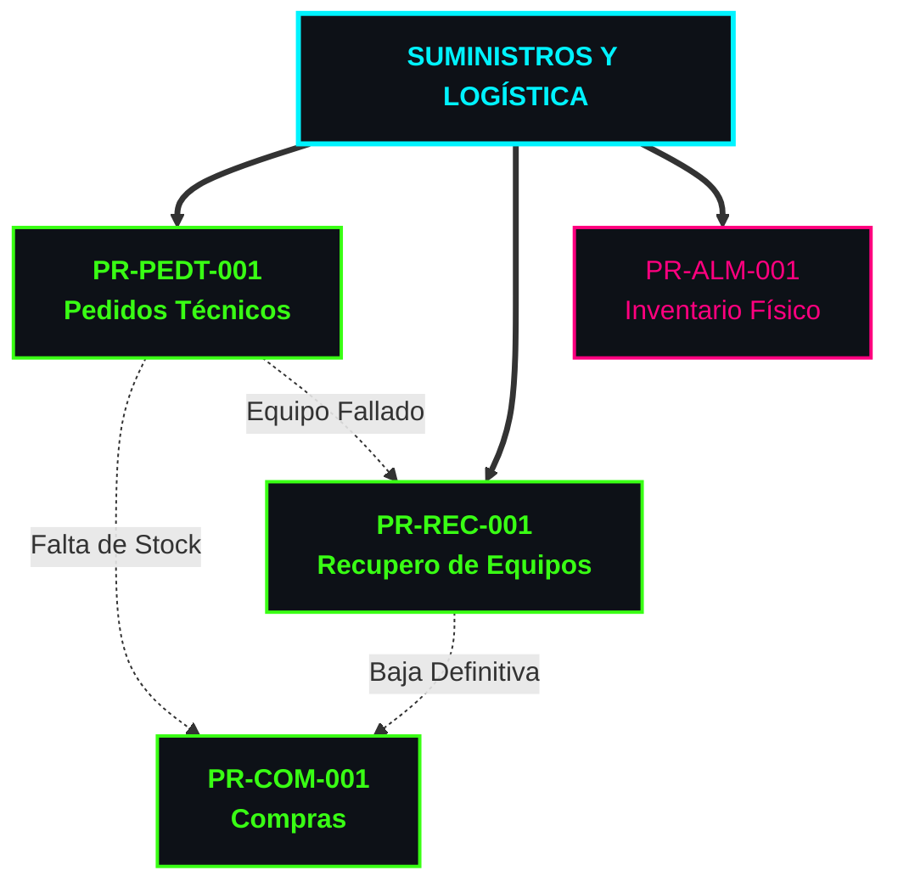

# Portal de Procedimientos Operativos - Obercom

Bienvenido al centro de documentación oficial. Navega a través de la red jerárquica de procesos para acceder a cada documento estandarizado.

---

**Áreas Operativas**
* **Suministros y Logística:** Gestión de compras, inventario de móviles y recupero de hardware.
