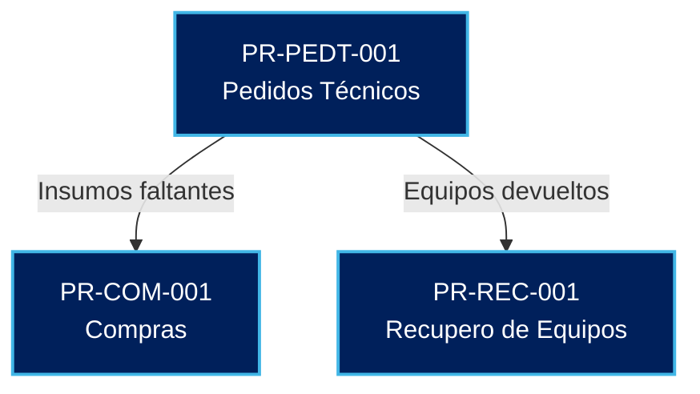

# Portal de Procedimientos Operativos - Obercom

Bienvenido al centro de documentación oficial. Utiliza el mapa interactivo o el menú lateral para acceder a los procedimientos estandarizados.

**Mapa de Interconexión de Procesos**

---

**Áreas Operativas**
* **Suministros y Logística:** Gestión de compras, inventario de móviles y recupero de hardware.
