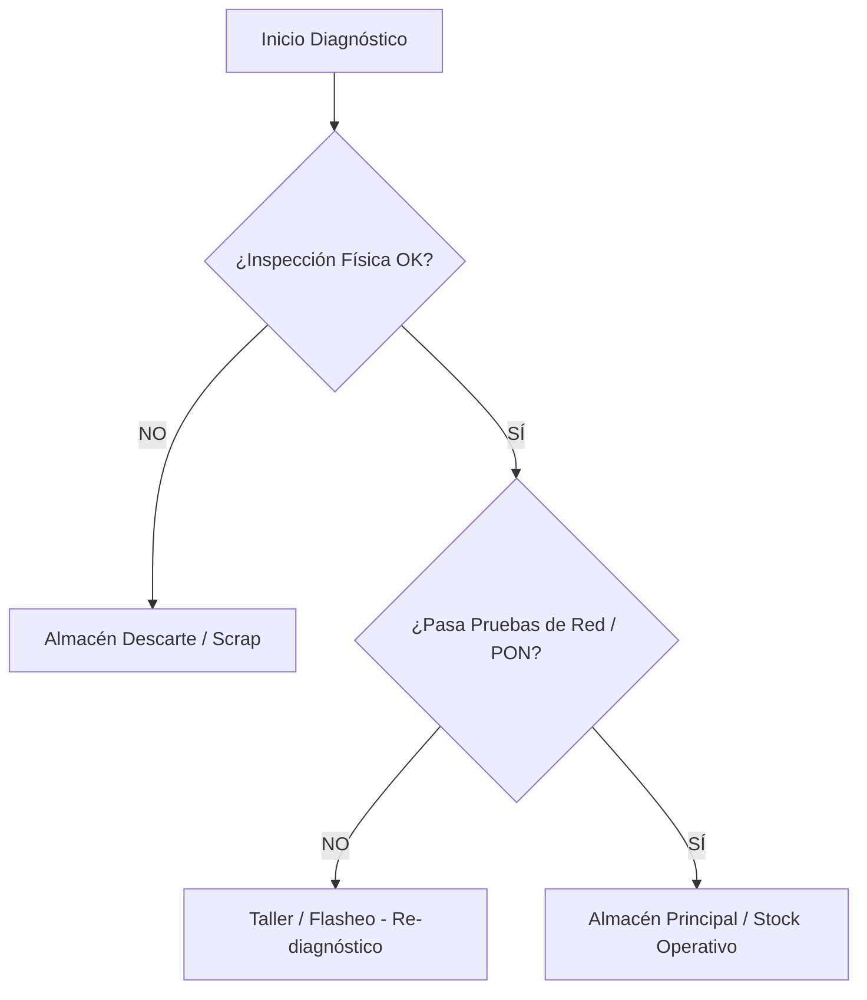

# [NOMBRE DEL DIAGNÓSTICO] ([CÓDIGO-000])

**Familia de Equipos:** [e.g. ONUs GPON / Routers / Fusionadoras] | **Estado:** Borrador / Aprobado | **Versión:** 0.1

---

## 1. Objetivo y Requisitos Previos

**Objetivo:** Estandarizar el protocolo de prueba técnica, verificación física y clasificación operativa de [tipo de equipo/dispositivo] para determinar su destino (reutilización, reparación o descarte).

* **Insumos y Herramientas Obligatorias:**
    * **Banco de Pruebas:** [e.g. Fuente de alimentación 12V 1.5A, Cable Ethernet Cat6, Atenuador óptico].
    * **Sistemas / Software:** [e.g. SmartOLT, SGR, Consola TFTP / SSH, Medidor de Potencia (OPM)].
    * **EPP y Seguridad:** [e.g. Protección ESD (Pulsera antiestática), Lentes de seguridad para manipulación de fibra].

---

## 2. Matriz de Triaje y Secuencia de Pruebas

| Paso | Etapa de Prueba | Criterio de Aceptación (OK) | Criterio de Falla (NOK) | Acción ante Falla |
| :--- | :--- | :--- | :--- | :--- |
| **1. Inspección Física** | Verificación estética y plásticos | Chasis íntegro, puerto óptico limpio, etiquetas legibles | Plástico partido, puerto roto, MAC/SN ilegible | Derivar a **Scrap / Descarte** |
| **2. Encendido (Power On)** | Conexión a fuente y bootloader | LEDs encienden correctamente y completan secuencia | LED apagado, parpadeo de error (Red Light) | Reemplazar fuente / Evaluar placa |
| **3. Potencia Óptica / PON** | Medición de RX con OPM | Nivel de recepción entre -8 dBm y -27 dBm | Sin señal (LOS) o potencia fuera de rango | Derivar a **Reparación Óptica** |
| **4. Conectividad y Wi-Fi** | Prueba de puertos LAN y RF 2.4/5GHz | Link a 1 Gbps en puertos LAN y SSID emitiendo | Puerto Ethernet muerto o Wi-Fi inestable | Intentar **Flasheo Firmware** |

---

## 3. Protocolo de Restablecimiento y Reacondicionamiento

* **Paso 1 (Hard Reset):** Mantener presionado el botón de Reset durante 10 segundos con el equipo encendido hasta el reinicio de LEDs.
* **Paso 2 (Actualización / Flasheo):** Cargar la versión de firmware homologada `[vX.X.X]` mediante [Portal Web / Servidor TFTP / SmartOLT].
* **Paso 3 (Sanitizado Físico):** Limpieza de chasis con alcohol isopropílico y colocado de tapón protector en el puerto óptico.

---

## 4. Criterios de Dictamen Final y Destino Físico

---

## 5. Gestión de Excepciones Técnicas

!!! warning "Falla de Firmware / Equipo 'Brickeado'"
    **Escenario:** El dispositivo no asigna IP por DHCP ni permite acceso a la interfaz de administración.  
    **Acción Correctiva:** Intentar recuperación por consola serie (TTL/UART) o TFTP. Si no responde en 15 minutos, declarar como no recuperable.

!!! failure "Módulo Óptico / Láser Quemado"
    **Escenario:** La ONU enciende pero no detecta potencia óptica en el puerto SC/APC a pesar de recibir señal válida de la OLT.  
    **Acción Correctiva:** Descartar de inmediato para evitar daños en la red PON y registrar la baja en SGR.

---

## 6. Indicadores de Gestión (KPIs)

* **Tasa de Efectividad del Diagnóstico:**
    * **Fórmula:** `(Cantidad de Equipos Reutilizables / Total de Equipos Testeados) × 100`
    * **Meta:** `≥ 80%`

* **Tiempo Promedio de Diagnóstico por Unidad:**
    * **Fórmula:** `Tiempo total de banco de prueba / Unidades procesadas`
    * **Meta:** `≤ 8 minutos por equipo`

---

## 7. Historial de Control de Cambios

| Versión | Fecha | Descripción de la Modificación | Autor |
| :--- | :--- | :--- | :--- |
| 0.1 | 16/08/2026 | Creación de la plantilla base para diagnósticos de hardware | Área de Mantenimiento / S&L |
