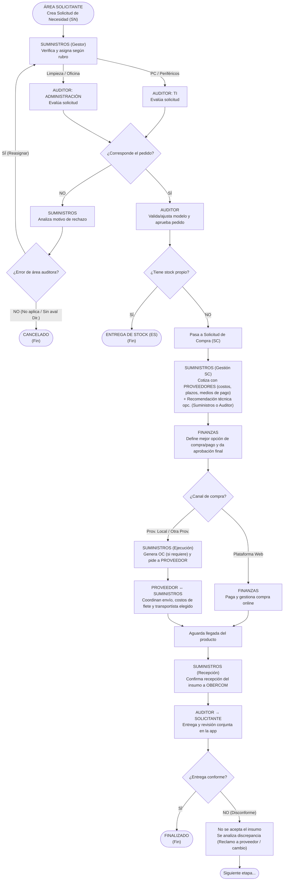

# Flujo de Compras - OBERCOM

```mermaid
flowchart TD
    Inicio(["ÁREA SOLICITANTE<br>Crea Solicitud de Necesidad (SN)"]) --> Sum1["SUMINISTROS (Gestor)<br>Verifica y asigna según rubro"]

    Sum1 -->|"PC / Periféricos"| AudTI["AUDITOR: TI<br>Evalúa solicitud"]
    Sum1 -->|"Limpieza / Oficina"| AudAdm["AUDITOR: ADMINISTRACIÓN<br>Evalúa solicitud"]

    AudTI --> DecCorresponde{"¿Corresponde el pedido?"}
    AudAdm --> DecCorresponde

    DecCorresponde -->|"NO"| SumRechazo["SUMINISTROS<br>Analiza motivo de rechazo"]
    SumRechazo --> DecErrorArea{"¿Error de área auditora?"}
    DecErrorArea -->|"SÍ (Reasignar)"| Sum1
    DecErrorArea -->|"NO (No aplica / Sin aval Dir.)"| FinCancelado(["CANCELADO<br>(Fin)"])

    DecCorresponde -->|"SÍ"| AudAprueba["AUDITOR<br>Valida/ajusta modelo y aprueba pedido"]
    AudAprueba --> DecStock{"¿Tiene stock propio?"}

    DecStock -->|"SÍ"| FinES(["ENTREGA DE STOCK (ES)<br>(Fin)"])
    DecStock -->|"NO"| PasaSC["Pasa a Solicitud de Compra (SC)"]

    PasaSC --> SumCotiza["SUMINISTROS (Gestión SC)<br>Cotiza con PROVEEDORES (costos, plazos, medios de pago)<br>+ Recomendación técnica opc. (Suministros o Auditor)"]
    SumCotiza --> FinanzasAprueba["FINANZAS<br>Define mejor opción de compra/pago y da aprobación final"]

    FinanzasAprueba --> DecCanal{"¿Canal de compra?"}

    DecCanal -->|"Plataforma Web"| FinanzasWeb["FINANZAS<br>Paga y gestiona compra online"]
    DecCanal -->|"Prov. Local / Otra Prov."| SumOC["SUMINISTROS (Ejecución)<br>Genera OC (si requiere) y pide a PROVEEDOR"]

    SumOC --> CoordEnvio["PROVEEDOR ↔ SUMINISTROS<br>Coordinan envío, costos de flete y transportista elegido"]

    FinanzasWeb --> EsperaProducto["Aguarda llegada del producto"]
    CoordEnvio --> EsperaProducto

    EsperaProducto --> SumRecepcion["SUMINISTROS (Recepción)<br>Confirma recepción del insumo a OBERCOM"]
    SumRecepcion --> RevisionConjunta["AUDITOR → SOLICITANTE<br>Entrega y revisión conjunta en la app"]

    RevisionConjunta --> DecConforme{"¿Entrega conforme?"}
    DecConforme -->|"SÍ"| FinOk(["FINALIZADO<br>(Fin)"])
    DecConforme -->|"NO (Disconforme)"| Disconformidad["No se acepta el insumo<br>Se analiza discrepancia (Reclamo a proveedor / cambio)"]
    Disconformidad --> SiguienteEtapa(["Siguiente etapa..."])
```
