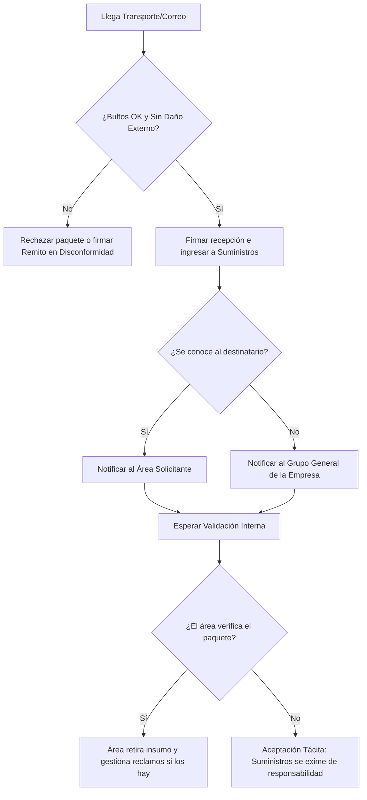

# Procedimiento de Recepción de Insumos y Paquetería General (PR-ALM-001)

**Norma ISO 9001:2015** | **Estado:** Borrador de Trabajo | **Versión:** 0.1 | **Fecha:** 18/08/2026

---

## 1. Objetivo y Alcance

**Objetivo:** Estandarizar la recepción física, el control exterior de bultos y la notificación de llegada de mercadería entregada por empresas de logística o mensajería, delimitando claramente las responsabilidades de control de calidad y gestión de reclamos entre el área de Suministros y las áreas solicitantes.

* **Qué HACE este procedimiento:**
    * Conteo de bultos contra el remito o carta de porte del transportista.
    * Revisión estética exterior de las cajas (golpes, humedad, fajas de seguridad rotas).
    * Recepción de la paquetería y firma de conformidad básica al correo/transporte.
    * Notificación inmediata al área solicitante (o al grupo general si el destinatario es desconocido).
    * Almacenamiento temporal (Staging) hasta el retiro por parte del interesado.
* **Qué NO HACE este procedimiento:**
    * Control de calidad, testeo o validación del contenido interno de paquetes pertenecientes a otras áreas (ej. Marketing, Administración, Técnica, etc.).
    * Gestión de reclamos, devoluciones o RMA ante proveedores por insumos que no pertenecen a Suministros y Logística.
    * Distribución o entrega "puerta a puerta" dentro de las oficinas de la empresa.

---

## 2. Matriz RACI y Descripción de Pasos

| Paso | Descripción de la Actividad | Responsable (R) | Aprueba (A) | Consultado (C) | Informado (I) |
| :--- | :--- | :--- | :--- | :--- | :--- |
| **1. Recepción y Conteo** | Recepción del transporte. Conteo de bultos y cotejo contra el remito de entrega. | ALM | ALM | - | - |
| **2. Control Estético** | Verificación visual del estado exterior de las cajas. Si hay daños visibles severos, se rechaza o se firma con reserva. | ALM | ALM | - | - |
| **3. Notificación Interna** | Aviso al área solicitante de la llegada del paquete. Si se desconoce el dueño, se avisa al grupo general de la empresa. | ALM | ALM | - | SOL |
| **4. Validación de Contenido** | El área solicitante se acerca a Suministros a abrir el paquete, verificar su contenido y estado interno. | SOL | SOL | ALM | - |
| **5. Cierre y Retiro** | El solicitante retira su mercadería. En caso de no presentarse en tiempo y forma, se asume conformidad (Aceptación Tácita). | SOL | ALM | - | - |

*Referencias de Roles:* **ALM:** Personal de Almacén/Suministros | **SOL:** Área Solicitante (Ej: MKT, RRHH, Administración)

---

## 3. Reglas Operativas del Proceso

* **Regla de Control Superficial:** Suministros (ALM) **solo se hace responsable** por la cantidad de bultos recibidos y que los mismos no presenten daños estructurales externos evidentes al momento de bajar del camión.
* **Regla de Aceptación Tácita y Exención de Responsabilidad:** Una vez notificada la llegada del paquete, el Área Solicitante tiene **48 horas hábiles** para acercarse a verificar el contenido. Si el área no se presenta, Suministros dará el material por "Aceptado", perdiendo el solicitante el derecho a exigir que Suministros inicie reclamos por faltantes internos o daños ocultos.
* **Regla de Autogestión de Reclamos:** Si al abrir el paquete el insumo (perteneciente a otra área) está dañado, es incorrecto o faltan piezas, **la gestión del reclamo ante el proveedor es responsabilidad exclusiva del Área Solicitante**, ya que la compra y la negociación fueron gestionadas por ellos. Suministros no intervendrá administrativamente.

---

## 4. Diagrama de Flujo del Proceso

---

## 5. Gestión de Excepciones

!!! warning "Cajas Abiertas, Violadas o Muy Dañadas en Recepción"
    **Escenario:** El correo intenta entregar un bulto que está visiblemente aplastado, mojado o con la cinta de seguridad cortada.  
    **Acción Correctiva:** El personal de Almacén debe **RECHAZAR** la entrega, sacar fotografías del estado de la caja y anotar el motivo del rechazo en el remito del chofer. Se debe notificar al área solicitante de inmediato.

!!! failure "Paquete sin Reclamar ("Paquete Huérfano")"
    **Escenario:** Se notificó al grupo general, pasaron más de 5 días hábiles y ningún área reclama la titularidad del insumo recibido.  
    **Acción Correctiva:** Almacén lo apartará en la zona de cuarentena. Si a los 15 días sigue sin reclamarse, la Gerencia de Suministros definirá su destino (incorporación a stock general, donación o descarte).

---

## 6. Indicadores de Gestión (KPIs)

* **Tiempo Promedio de Retiro de Paquetería General:**
    * **Fórmula:** `(Suma del tiempo desde Notificación hasta Retiro) / Total de paquetes de otras áreas`
    * **Meta:** `≤ 48 horas hábiles`

* **Porcentaje de Entregas Rechazadas por Daños Logísticos:**
    * **Fórmula:** `(Bultos rechazados al transporte / Total de bultos recibidos) × 100`
    * **Meta:** `Seguimiento e información de gestión (Ideal ≤ 2%)`

---

## 7. Historial de Control de Cambios

| Versión | Fecha | Descripción de la Modificación | Autor |
| :--- | :--- | :--- | :--- |
| 0.1 | 18/08/2026 | Confección del borrador inicial definiendo límites de responsabilidad en recepción de paquetería | Gerencia de S&L |
