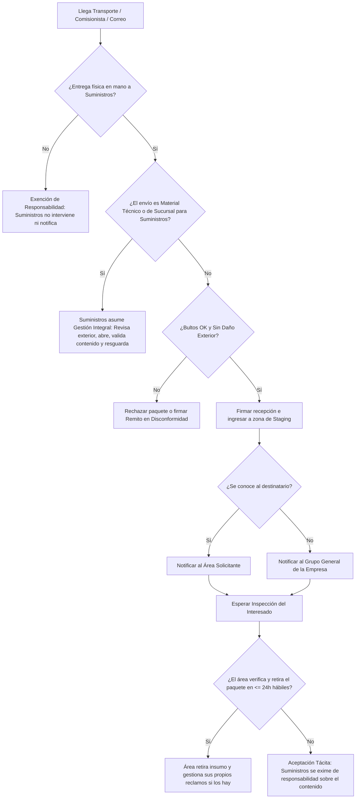

<button onclick="window.print()" class="md-button md-button--primary btn-print" style="margin-bottom: 15px;">
  🖨️ Imprimir / Descargar PDF
</button>

# Procedimiento de Recepción de Insumos y Paquetería General (PR-ALM-001)

**Norma ISO 9001:2015** | **Estado:** Borrador Consolidado | **Versión:** 1.0 | **Fecha:** 18/08/2026

---

## 1. Objetivo y Alcance

**Objetivo:** Estandarizar la recepción física, el control exterior de bultos y la notificación de llegada de mercadería entregada por empresas de logística, mensajería o traslados entre sucursales, delimitando claramente las responsabilidades de control de calidad, custodia y gestión de reclamos entre el área de Suministros y las áreas solicitantes.

* **Qué HACE este procedimiento:**
    * **Gestión Integral (Suministros/Técnica):** Recepción, apertura, verificación de contenido, resguardo y garantía de insumos técnicos, herramientas y envíos entre sucursales destinados a la operatoria de Suministros.
    * **Gestión Limitada (Otras Áreas):** Conteo de bultos contra remito, revisión estética exterior, recepción y firma de conformidad básica para bienes misceláneos o de uso exclusivo de otros sectores (mobiliario, decoración, papelería, tecnología específica, etc.).
    * Notificación de llegada al área solicitante (o al grupo general si el destinatario es desconocido).
    * Almacenamiento temporal (*Staging*) hasta el retiro por parte del área interesada.
* **Qué NO HACE este procedimiento:**
    * Control de calidad, testeo o validación del contenido interno de paquetes pertenecientes a otras áreas (ej. Marketing, Administración, Recursos Humanos, etc.).
    * Gestión de reclamos, devoluciones o RMA ante proveedores por insumos que no pertenecen a Suministros.
    * Búsqueda, custodia o notificación de elementos dejados en vehículos, pasillos o descargas no supervisadas que no hayan sido entregados formalmente en mano al personal de Suministros.
    * Distribución o entrega "puerta a puerta" dentro de las instalaciones.

---

## 2. Matriz RACI y Descripción de Pasos

| Paso | Descripción de la Actividad | Responsable (R) | Aprueba (A) | Consultado (C) | Informado (I) |
| :--- | :--- | :--- | :--- | :--- | :--- |
| **1. Recepción y Conteo** | Recepción física del transporte o comisionista en Suministros. Conteo de bultos y cotejo contra remito. | ALM | ALM | - | - |
| **2. Control Estético** | Verificación visual exterior de los bultos. Si hay daño severo, se rechaza o firma con reserva. | ALM | ALM | - | - |
| **3. Clasificación y Validación** | **Técnico/Sucursal:** ALM abre, valida contenido y resguarda. **Otras Áreas:** ALM no abre; ubica en zona de *Staging*. | ALM | ALM | SOL | - |
| **4. Notificación Interna** | Aviso inmediato al área solicitante de la llegada del paquete. Si se desconoce el dueño, se notifica al grupo general. | ALM | ALM | - | SOL |
| **5. Inspección y Retiro** | El área solicitante acude a Suministros a abrir, inspeccionar el contenido y retirar su paquete. | SOL | SOL | ALM | - |
| **6. Cierre por Aceptación Tácita** | Transcurridas 24 h hábiles sin revisión del interesado, el material se da por aceptado sin derecho a reclamos a ALM. | SOL | ALM | - | - |

*Referencias de Roles:* **ALM:** Personal de Almacén/Suministros | **SOL:** Área Solicitante (Ej: MKT, RRHH, Administración, Comercial)

---

## 3. Reglas Operativas del Proceso

* **Regla de Diferenciación de Materiales:** 
    * **Material Técnico / Insumos de Sucursales:** Suministros asume la gestión integral (recepción, apertura, verificación de estado/contenido, registro y resguardo).
    * **Bienes de Uso y Misceláneos (Mobiliario, Plantas/Decoración, Documentación):** Suministros actúa únicamente como punto de recepción superficial y acopio temporal.
* **Regla de Entrega Formal (Exención por Vehículos / Descarga No Supervisada):** Suministros **únicamente** emitirá avisos de llegada y asumirá custodia de los insumos que hayan sido entregados físicamente en mano al personal de Suministros. Suministros **no rastreará, no notificará ni se hará responsable** por materiales, cajas o herramientas que queden dentro de vehículos de la flota (ej. tras regresar de una comisión) o en zonas comunes si no fueron entregados formalmente.
* **Regla de Control Superficial (Otras Áreas):** Para paquetes de otros sectores, Suministros **solo responde** por la cantidad de bultos recibidos y la integridad estética externa al momento del ingreso.
* **Regla de Aceptación Tácita y Exención de Responsabilidad:** Notificada la llegada del paquete, el Área Solicitante dispone de **24 horas hábiles** para revisar el contenido. Cumplido el plazo, el insumo se considerará "Aceptado", liberando a Suministros de cualquier responsabilidad por faltantes internos o daños ocultos.
* **Regla de Autogestión de Reclamos:** Si al abrir el paquete el insumo de otra área presenta fallas, roturas internas o faltantes, **la gestión del reclamo ante el proveedor es responsabilidad exclusiva del Área Solicitante**. Suministros no realizará gestiones administrativas ni seguimiento. **[VER ESTE ALCANCE]**

## 4. Diagrama de Flujo del Proceso

## 5. Gestión de Excepciones

> **ADVERTENCIA: Cajas Abiertas, Violadas o Severamente Dañadas**
> * **Escenario:** El transporte intenta entregar un bulto visiblemente aplastado, mojado, abierto o con cintas de seguridad violentadas.
> * **Acción Correctiva:** El personal de Suministros debe **RECHAZAR** la entrega, tomar registro fotográfico del estado del bulto y dejar asentado el motivo en la hoja de ruta/remito del chofer. Se debe notificar inmediatamente al área solicitante.

> **ALERTA: Descarga No Supervisada / Material Olvidado en Vehículos**
> * **Escenario:** Llega un vehículo de comisión o logística y se dejan insumos, herramientas o bienes en el baúl/caja del vehículo o en pasillos sin avisar ni entregar en mano al personal de Suministros.
> * **Acción Correctiva:** Suministros no asumirá la responsabilidad de inventariar ni notificar dicho material. La responsabilidad del estado y extravío del insumo recaerá 100% en la persona a cargo del traslado o en el área solicitante.

> **DESVIACIÓN: Paquete Sin Reclamar ("Paquete Huérfano")**
> * **Escenario:** Se notificó al grupo general, pasaron más de 5 días hábiles y ningún sector reclama la titularidad del paquete.
> * **Acción Correctiva:** Suministros trasladará el bulto a la Zona de Cuarentena. Si transcurridos 15 días hábiles continúa sin ser reclamado, la Gerencia de Suministros definirá su destino final (alta en stock general, donación o descarte).

---

## 6. Indicadores de Gestión (KPIs)

* **Tiempo Promedio de Retiro de Paquetería General:**
    * **Fórmula:** `(Suma de horas desde Notificación hasta Retiro por el Área) / Total de paquetes de otras áreas`
    * **Meta:** `≤ 24 horas hábiles`

* **Porcentaje de Entregas Rechazadas por Daños Logísticos:**
    * **Fórmula:** `(Bultos rechazados al transporte / Total de bultos recibidos) × 100`
    * **Meta:** `≤ 2%`

---

## 7. Historial de Control de Cambios

| Versión | Fecha | Descripción de la Modificación | Autor |
| :--- | :--- | :--- | :--- |
| 0.1 | 18/08/2026 | Confección del borrador inicial definiendo límites de responsabilidad en recepción de paquetería. | Gerencia de S&L |
| 1.0 | 18/08/2026 | Integración de reglas diferenciadas para material técnico/sucursales, exención por cargas no entregadas en mano (vehículos) y ajuste de flujograma. | Gerencia de S&L |
