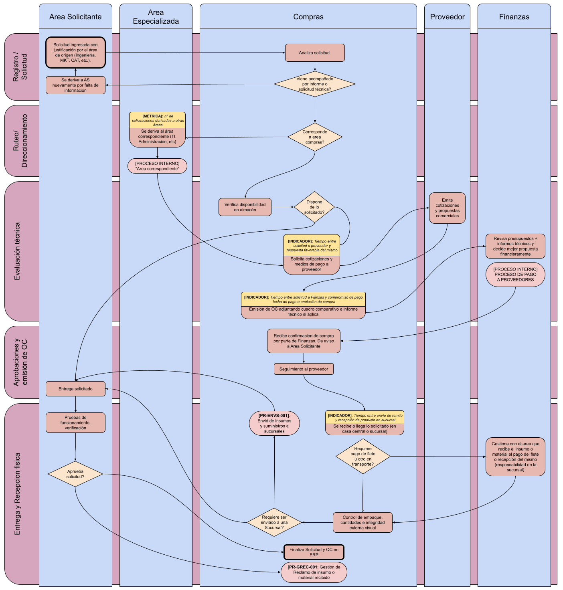

<button onclick="window.print()" class="md-button md-button--primary btn-print" style="margin-bottom: 15px;">
  🖨️ Imprimir / Descargar PDF
</button>

# Procedimiento General de Compras (PR-COM-001)

**Norma ISO 9001:2015 - Cláusula 8.4** | **Estado:** Borrador Consolidado | **Versión:** 0.4 | **Fecha:** 24/08/2026

---

## 1. Objetivo y Alcance

**Objetivo:** Normar y centralizar la adquisición de bienes, equipos e insumos garantizando la calidad requerida, la optimización de costos y el cumplimiento de los plazos de entrega.

* **Qué HACE (Alcance IN):**
    * Recepción y análisis de Solicitudes de Pedido (SolPed).
    * Verificación de disponibilidad previa en almacén/inventario.
    * Ruteo de requerimientos a áreas técnicas especializadas.
    * Cotización con proveedores homologados y confección de cuadros comparativos.
    * Emisión de Órdenes de Compra (OC) y seguimiento de entregas.
    * Coordinación y despacho de envíos de insumos a sucursales (`PR-ENVS-001`).
    * *Alcance Transitorio:* Gestión temporal de negociaciones comerciales, cuotas, notas de crédito y trámites aduaneros asumidos operativamente por S&L.
* **Qué NO HACE (Alcance OUT):**
    * Pruebas de funcionamiento y conformidad técnica del bien (corresponde al área solicitante; ver `PR-ALM-001`).
    * Registro de facturas, liquidación y pago a proveedores (corresponde a Finanzas).
    * Administración de instrumentos bancarios, cuentas corporativas o billeteras virtuales.
    * Intermediación o canalización de solicitudes de pago por fletes/envíos en destino (corresponde a la Sucursal en coordinación directa con Finanzas).

---

## 2. Matriz RACI y Descripción de Pasos

*(Premisa: Post aprobación presupuestaria de Finanzas)*.

| Etapa del Flujo | Descripción y Criterio | Responsable (R) | Aprueba (A) | Consultado (C) | Informado (I) |
| :--- | :--- | :--- | :--- | :--- | :--- |
| **1. Registro / Solicitud** | Ingreso de SolPed en ERP y filtro inicial de informe técnico adjunto. | Área Solicitante | Gerente Solicitante | Compras | - |
| **2. Ruteo / Direccionamiento** | Clasificación del pedido y derivación a Compras o Área Especializada. | Compras | Jefe de Compras | Área Especializada | Área Solicitante |
| **3. Evaluación Técnica** | Verificación de stock en almacén. Si no hay, solicitud de cotizaciones. | Compras / Área Esp. | Finanzas *(Decisión financiera)* | Proveedor | Área Solicitante |
| **4. Aprobaciones y Emisión OC** | Generación de OC con cuadro comparativo y confirmación de compra. | Compras | Gerencia Financiera | Proveedor | Área Solicitante |
| **5. Entrega y Recepción Física** | Control visual, envío a sucursales (`PR-ENVS-001`), prueba de funcionamiento, cierre o reclamo (`PR-GREC-001`). | Área Solicitante (Pruebas) / Compras (Físico) | Gerente Solicitante | Compras | Finanzas *(libera pago)* |

---

## 3. Reglas Operativas del Proceso

* **Centralización Obligatoria:** Toda adquisición debe gestionarse mediante SolPed formal en el ERP corporativo. Se prohíben las compras directas no autorizadas.
* **Prioridad de Inventario:** Si el bien solicitado está disponible en almacén, se anula la compra externa y se gestiona entrega directa.
* **Subprocesos Vinculados:** El despacho a sucursales se ejecuta bajo el procedimiento `PR-ENVS-001`. Todo rechazo en la prueba de funcionamiento deriva inmediatamente al procedimiento `PR-GREC-001`.
* **Despacho y Pago de Fletes en Destino:** En envíos que requieran pago contra entrega en sucursales, la responsabilidad de S&L finaliza al notificar el número de guía y transporte. La gestión del comprobante y la solicitud del desembolso económico se realiza **exclusivamente entre la Sucursal y Finanzas**, sin intermediación de Compras.

---

## 4. Diagrama de Flujo del Proceso

---

## 5. Gestión de Excepciones

* **Falta de Información Técnica (Etapa 1):** Compras rechaza la SolPed y la reasigna al Área Solicitante para su completitud.
* **Existencia en Almacén (Etapa 3):** Se frena la cotización externa y se emite vale de salida de inventario al Solicitante.
* **Desviación Presupuestaria / Proveedor Único (Etapa 3):** Se exige ficha de justificación o aval de sobrecosto firmado por la Gerencia Solicitante.
* **Inconsistencia en Recepción Física (Etapa 5):** Compras firma remito en disconformidad e inicia reclamo a la transportista/proveedor dentro de las 24 hs.
* **Pago de Flete contra Entrega en Sucursal (Etapa 5 - `PR-ENVS-001`):** Al arribar una encomienda con cobro en destino, la Sucursal envía foto del comprobante/factura **directamente al canal oficial de Finanzas**. Compras/S&L no actúa como gestor ni intermediario de dicho pago.
* **Rechazo Técnico en Pruebas (Etapa 5):** El Solicitante emite Ticket de No Conformidad. Se activa el protocolo `PR-GREC-001` (Gestión de Reclamo de Insumo) para reemplazo, Nota de Crédito o reembolso.

---

## 6. Indicadores de Gestión (KPIs)

**Métricas de Operación Directa (Flujograma):**
* **Derivaciones Técnicas:** Nº de solicitudes derivadas a Áreas Especializadas.
* **Respuesta de Proveedores:** Tiempo entre la solicitud de cotización y la respuesta comercial favorable.
* **Lead Time de Aprobación:** Tiempo entre solicitud a Finanzas y confirmación de compra / emisión de OC.
* **Efectividad de Envíos:** Tiempo entre emisión del remito y recepción del producto en sucursal (`PR-ENVS-001`).

**KPIs Globales de Calidad ISO 9001:**
* **Cumplimiento del Proveedor (OTIF):**
  * `(OC Entregadas a Tiempo y Completas / Total OC) × 100` | **Meta:** ≥ 90%
* **Lead Time de Compras:**
  * `Fecha Emisión OC - Fecha Aprobación SolPed` | **Meta:** ≤ 2 días hábiles
* **Tasa de Rechazo:**
  * `(Unidades Defectuosas / Total Recibido) × 100` | **Meta:** ≤ 2%
* **Compras Fuera de Proceso:**
  * `(Compras sin Validación / Total Compras) × 100` | **Meta:** ≤ 3%

---

## 7. Historial de Control de Cambios

| Versión | Fecha | Descripción de la Modificación | Autor |
| :--- | :--- | :--- | :--- |
| 0.1 | 04/08/2026 | Estructuración inicial del borrador de compras | Suministros y Logística |
| 0.2 | 07/08/2026 | Consolidación de matriz RACI, excepciones y diagrama de flujo matricial | Suministros y Logística |
| 0.3 | 20/08/2026 | Alineación total con flujograma FLUJO-COM, integración de subprocesos y métricas operativas | Suministros y Logística |
| 0.4 | 24/08/2026 | Deslinde formal de S&L en la intermediación de pagos de fletes en destino (comunicación directa Sucursal-Finanzas) | Suministros y Logística |
