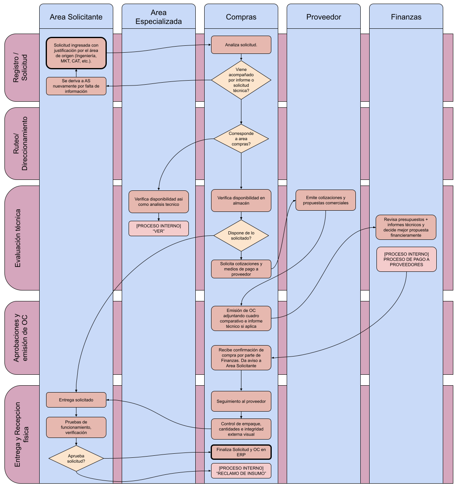

# Procedimiento General de Compras (PR-COM-001)

**Norma ISO 9001:2015 - Cláusula 8.4** | **Estado:** Borrador Consolidado | **Versión:** 0.2 | **Fecha:** 07/08/2026[cite: 3]

---

## 1. Objetivo y Alcance

**Objetivo:** Normar y centralizar la adquisición de bienes, equipos e insumos garantizando la calidad requerida, la optimización de costos y el cumplimiento de los plazos de entrega[cite: 3].

* **Qué HACE:**
    * Recepción y validación de Solicitudes de Pedidos (SolPed)[cite: 3].
    * Verificación de disponibilidad previa en almacén/inventario[cite: 3].
    * Cotización con proveedores homologados (cuando la situación lo requiera) y selección de ofertas[cite: 3].
    * Emisión y aprobación de Órdenes de Compra (OC)[cite: 3].
    * Seguimiento de entregas[cite: 3].
    * Gestión del fondo operativo exclusivo (caja chica) de Suministros y Logística (S&L) destinado al pago de envíos no previstos a sucursales[cite: 3].
* **Qué NO HACE:**
    * Recepción e inspección física/técnica del bien o equipo (corresponde al área solicitante/destinataria una vez arribada la mercancía)[cite: 3].
    * Registro de facturas, liquidaciones y pagos a proveedores (corresponde a Finanzas)[cite: 3].
    * Administración de fondos corporativos (cajas de ahorro, tarjetas, cuentas o billeteras virtuales) para financiación o pago directo fuera del fondo de envíos de S&L[cite: 3].
    * Negociación, planes de pagos, opciones de pagos, cuotas, notas de crédito, gestiones aduaneras y arancelarias intervinientes[cite: 3].

---

## 2. Matriz RACI y Descripción de Pasos

*(Premisa: Post aprobación de Finanzas de la disposición de dinero destinado para tal fin)*[cite: 3].

| Paso del Proceso | Descripción y Criterio | Responsable (R) | Aprueba (A) | Consultado (C) | Informado (I) |
| :--- | :--- | :--- | :--- | :--- | :--- |
| **1. Recepción de SolPed** | Solicitud ingresada con justificación por el área de origen (Ingeniería, MKT, CAT, etc.)[cite: 3]. | Área Solicitante | Gerente del Área Solicitante | Compras | - |
| **2. Ruteo Técnico y Stock** | Derivación del pedido a áreas especializadas (TI, DHO, Administración) y chequeo de existencias en almacén[cite: 3]. | Compras | Jefe de Compras | Área Técnica Especializada | Área Solicitante |
| **3. Cotización y Evaluación** | Análisis comercial/técnico. Gestión de ofertas y cuadro comparativo (o justificación de proveedor único/monopolio)[cite: 3]. | Compras | Gerente del Área Solicitante | Área Técnica | - |
| **4. Fondo de Envíos S&L** | Gestión de pagos urgentes de fletes/envíos no previstos a sucursales con fondo propio asignado a S&L[cite: 3]. | Compras | Jefe de Compras | - | Finanzas |
| **5. Emisión y Firma de OC** | Generación de la OC adjuntando cuadro comparativo e informe técnico si aplica[cite: 3]. | Compras | Gerencia Financiera / Dirección | Proveedor | Área Solicitante |
| **6. Seguimiento de Entrega** | Control del plazo de entrega pactado con el proveedor (Lead Time comercial)[cite: 3]. | Compras | Jefe de Compras | Proveedor / Área Solicitante | - |
| **7a. Recepción Física** | Control de empaque, cantidades e integridad externa visual al recibir el paquete/remito[cite: 3]. | Compras | Jefe de Compras | Proveedor / Transporte | Área Solicitante |
| **7b. Conformidad Técnica** | Pruebas de funcionamiento, verificación contra especificaciones e informe técnico[cite: 3]. | Área Solicitante | Jefe del Área Solicitante | Compras | Finanzas (libera pago) |

---

## 3. Reglas Operativas del Proceso

* **Centralización de Compras:** Toda adquisición de insumos, equipos o servicios debe canalizarse a través de una SolPed en el ERP. Se prohíben las compras directas sin validación previa (*Maverick Buying*)[cite: 3].
* **Límite de Fondo S&L:** El fondo propio de Suministros y Logística está restringido exclusivamente a fletes urgentes a sucursales y requiere comprobante fiscal válido para su rendición ante Finanzas[cite: 3].
* **Cuadro Comparativo:** Requisito obligatorio de 3 cotizaciones para evaluaciones comerciales, salvo casos justificados de Proveedor Único o Monopolio[cite: 3].

---

## 4. Diagrama de Flujo del Proceso

---

## 5. Gestión de Excepciones

!!! failure "Paso 1: SolPed Incompleta o sin especificaciones"
    **Escenario:** La SolPed no cuenta con el detalle técnico suficiente para cotizar[cite: 3].
    **Acción Correctiva:** Compras rechaza la solicitud en el ERP; el pedido vuelve a estado borrador al Área Solicitante[cite: 3].

!!! warning "Paso 1: Falta de partida presupuestaria"
    **Escenario:** El centro de costos no cuenta con saldo disponible[cite: 3].
    **Acción Correctiva:** El ERP bloquea la solicitud hasta que la Gerencia del Área reasigne fondos o tramite una ampliación de presupuesto[cite: 3].

!!! note "Paso 2: Excepciones de Ruteo Técnico y Stock"
    * **Demora del Área Técnica (>48 hs):** Alerta automática a Jefatura de la especialidad para destrabar la Ficha Técnica[cite: 3].
    * **Disponibilidad en Almacén:** Si existe stock propio, se cancela la compra externa y se gestiona el envío directo mediante vale de salida[cite: 3].
    * **Inviabilidad del bien solicitado:** El Área Técnica emite informe de discontinuidad y propone una alternativa homologada equivalente[cite: 3].

!!! warning "Paso 3: Excepciones en Cotización y Evaluación"
    * **Proveedor Único / Monopolio:** Compras completa la Ficha de Justificación previa confirmación del Área Solicitante[cite: 3].
    * **Ofertas superan presupuesto:** Se tramita la autorización de sobrecosto con la Gerencia Solicitante antes de enviar a aprobación financiera[cite: 3].
    * **Inconsistencia en el pedido:** Si Compras detecta que lo cotizado no cubre la necesidad, devuelve el expediente al Área Solicitante para reevaluar[cite: 3].

!!! danger "Paso 4: Excepciones en Fondo de Envíos S&L"
    * **Monto excede el límite:** Se anula la vía rápida de pago directo y se canaliza por el flujo regular (SolPed + OC) o autorización especial de Finanzas[cite: 3].
    * **Falta de comprobante fiscal válido:** Compras rechaza el desembolso; no se rinden gastos sin factura formal. La unidad solicitante debe regularizar el monto directamente con Finanzas[cite: 3].

!!! failure "Paso 5: Excepciones en Emisión de OC"
    * **Proveedor altera condiciones:** Compras congela la OC. Se evalúa con Finanzas y el Solicitante si se continúa o se rescinde el acuerdo[cite: 3].
    * **Rechazo de Gerencia Financiera:** Se cancela la OC en el ERP informando el motivo al Solicitante[cite: 3].

!!! warning "Paso 6: Incumplimiento de Plazo (Lead Time)"
    **Escenario:** El proveedor no entrega en la fecha pactada[cite: 3].
    **Acción Correctiva:** Compras emite reclamo formal. Si la demora supera los 5 días, se evalúa sanción en scoring o cambio de proveedor[cite: 3].

!!! danger "Paso 7a: Recepción Física con Inconsistencias"
    **Escenario:** Empaque dañado, abierto o faltante de mercadería al recibir[cite: 3].
    **Acción Correctiva:** Compras rechaza la recepción o firma el remito en disconformidad e inicia el reclamo logístico dentro de las 24 hs, notificando al Solicitante[cite: 3].

!!! failure "Paso 7b: Rechazo en Conformidad Técnica"
    **Escenario:** Falla de funcionamiento o incumplimiento de especificaciones en las pruebas del Solicitante[cite: 3].
    **Acción Correctiva:** El Solicitante emite Ticket de No Conformidad. Compras bloquea el pago en Finanzas e inicia garantía/devolución. Si ya se pagó, coordina reintegro, Nota de Crédito o sustitución[cite: 3].

---

## 6. Indicadores de Gestión (KPIs)

* **Cumplimiento del Proveedor (OTIF - On Time In Full):**[cite: 3]
  $$\text{OTIF} = \left( \frac{\text{Órdenes Entregadas a Tiempo y Completas}}{\text{Total de Órdenes de Compra Emitidas}} \right) \times 100$$[cite: 3]
  * **Meta:** $\ge 90\%$[cite: 3]

* **Lead Time del Proceso de Compras:**[cite: 3]
  $$\text{Lead Time} = \text{Fecha de Emisión de OC} - \text{Fecha de Aprobación de SolPed}$$[cite: 3]
  * **Meta:** $\le 2$ días hábiles[cite: 3]

* **Tasa de Rechazo (Calidad de Recepción):**[cite: 3]
  $$\text{Tasa de Rechazo} = \left( \frac{\text{Cantidad de Unidades Defectuosas o Rechazadas}}{\text{Total de Unidades Recibidas}} \right) \times 100$$[cite: 3]
  * **Meta:** $\le 2\%$[cite: 3]

* **Compras Fuera de Proceso (Maverick Buying):**[cite: 3]
  $$\text{Maverick Buying} = \left( \frac{\text{Número de Compras Ejecutadas sin Validación}}{\text{Total de Compras Realizadas}} \right) \times 100$$[cite: 3]
  * **Meta:** $\le 3\%$[cite: 3]

---

## 7. Historial de Control de Cambios

| Versión | Fecha | Descripción de la Modificación | Autor |
| :--- | :--- | :--- | :--- |
| 0.1 | 04/08/2026 | Estructuración inicial del borrador de compras | Suministros y Logística[cite: 1] |
| 0.2 | 07/08/2026 | Consolidación de matriz RACI, excepciones y diagrama de flujo matricial | Suministros y Logística[cite: 3] |
