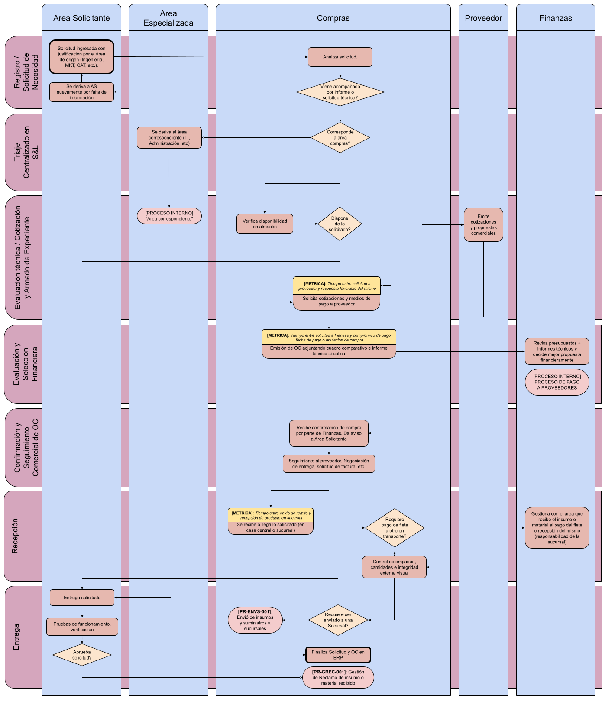

<button onclick="window.print()" class="md-button md-button--primary btn-print" style="margin-bottom: 15px;">
  🖨️ Imprimir / Descargar PDF
</button>

# Procedimiento General de Compras (PR-COM-001)

**Norma ISO 9001:2015 - Cláusula 8.4** | **Estado:** Oficial / Ejecutable | **Versión:** 1.0 | **Fecha:** 31/08/2026

---

## 1. Objetivo y Alcance

**Objetivo:** Normar y centralizar la adquisición de bienes, equipos e insumos garantizando la calidad requerida, la optimización de costos y el cumplimiento de los plazos de entrega.

* **Qué HACE (Alcance IN):**
    * Recepción y análisis de Solicitudes de Pedido (SolPed).
    * Verificación de disponibilidad previa en almacén/inventario.
    * Ruteo de requerimientos a áreas técnicas especializadas.
    * Cotización con proveedores homologados y confección de cuadros comparativos.
    * Emisión de Órdenes de Compra (OC) y seguimiento de entregas.
    * Coordinación y despacho de envíos de insumos a sucursales (`PR-ENVS-001`).
    * *Alcance Transitorio:* Gestión temporal de negociaciones comerciales, cuotas, notas de crédito y trámites aduaneros asumidos operativamente por S&L.
* **Qué NO HACE (Alcance OUT):**
    * Pruebas de funcionamiento y conformidad técnica del bien (corresponde al área solicitante; ver `PR-ALM-001`).
    * Registro de facturas, liquidación y pago a proveedores (corresponde a Finanzas).
    * Administración de instrumentos bancarios, cuentas corporativas o billeteras virtuales.
    * Intermediación o canalización de solicitudes de pago por fletes/envíos en destino (corresponde a la Sucursal en coordinación directa con Finanzas).

---

## 2. Matriz RACI y Descripción de Pasos

*(Premisa: Post comprobación de necesidad y disponibilidad)*.

| Etapa del Flujo / Actividad | Área Solicitante | Área Especializada (TI / Adm / DHO) | Compras (S&L) | Proveedor | Finanzas |
| :--- | :---: | :---: | :---: | :---: | :---: |
| **1. Registro / Solicitud de Necesidad** Ingreso de SolPed con justificación y revisión de información técnica. | **R / A** | - | **C** | - | - |
| **2. Triaje Centralizado en S&L** Clasificación de la solicitud y direccionamiento según corresponda. | **I** | **C** | **R / A** | - | - |
| **3. Evaluación Técnica / Cotización y Armado de Expediente** Filtro de stock en almacén, proceso técnico interno, solicitud de cotizaciones y propuestas comerciales. | **I** | **R / A** *(Dictamen)* | **R** *(Stock / Cotizar)* | **C** *(Emite oferta)* | - |
| **4. Evaluación y Selección Financiera** Emisión de OC con cuadro comparativo, revisión financiera y selección de la propuesta ganadora. | **I** | - | **R** | **I** | **R / A** *(Selección)* |
| **5. Confirmación y Seguimiento Comercial de OC** Aviso de compra al Solicitante, seguimiento de plazos con proveedor, negociación de entrega y solicitud de factura. | **I** | - | **R / A** | **C** | **I** |
| **6. Recepción** Control visual de empaque/cantidades y gestión directa del pago de flete en destino con el área receptora. | **I** | - | **R / A** *(Control Físico)* | - | **R** *(Pago Flete)* |
| **7. Entrega** Pruebas de funcionamiento/verificación del usuario, envío a sucursal (`PR-ENVS-001`), cierre en ERP o reclamo (`PR-GREC-001`). | **R / A** *(Pruebas)* | - | **R** *(Logística/Cierre)* | **I** *(En reclamo)* | **I** *(Cierre)* |

---

## 3. Reglas Operativas del Proceso

* **Centralización Obligatoria:** Toda adquisición de bienes, equipos, indumentaria o servicios debe gestionarse mediante SolPed formal en el ERP corporativo. Se prohíben las compras directas o fuera del circuito oficial.
* **Ruteo Técnico Obligatorio y Filtro de Inventario:**
  * Toda SolPed de tecnología (TI), indumentaria/EPP (DHO) o mobiliario/oficina (Administración) se deriva primero al área especialista.
  * Si el área técnica dispone de stock en almacén interno, entrega el producto directamente y cierra el circuito sin requerir compra externa.
* **Aporte Mandatorio Técnico (Áreas Especialistas → Compras):** Ante quiebre de stock, el área técnica aprueba la necesidad en el ERP y **debe adjuntar obligatoriamente** el modelo exacto, ficha técnica, presupuesto base o proveedor homologado para evitar búsquedas a ciegas por parte de Compras.
* **Despacho y Pago de Fletes en Destino:** En envíos que requieran pago contra entrega en sucursales, la responsabilidad de S&L finaliza al notificar la guía y transporte. La gestión del comprobante y el desembolso económico se realiza **exclusivamente entre la Sucursal y Finanzas**, sin intermediación de S&L.
* **Corresponsabilidad y Subprocesos Vinculados:**
  * El despacho de insumos a sucursales se ejecuta bajo el procedimiento `PR-ENVS-001`.
  * El Área Solicitante es la responsable directa de realizar las pruebas de funcionamiento y seguimiento de su paquete. Todo rechazo en la verificación técnica activa inmediatamente el protocolo de reclamos `PR-GREC-001`.

---

## 4. Diagrama de Flujo del Proceso

---

## 5. Gestión de Excepciones

* **Falta de Información Técnica (Etapa 1):** Compras rechaza la SolPed y la reasigna al Área Solicitante para su completitud.
* **Existencia en Almacén (Etapa 3):** Se frena la cotización externa y se emite vale de salida de inventario al Solicitante.
* **Desviación Presupuestaria / Proveedor Único (Etapa 3):** Se exige ficha de justificación o aval de sobrecosto firmado por la Gerencia Solicitante.
* **Inconsistencia en Recepción Física (Etapa 6):** Compras firma remito en disconformidad e inicia reclamo a la transportista/proveedor dentro de las 24 hs.
* **Pago de Flete contra Entrega en Sucursal (Etapa 5 - `PR-ENVS-001`):** Al arribar una encomienda con cobro en destino, la Sucursal envía foto del comprobante/factura **directamente al canal oficial de Finanzas**. Compras/S&L no actúa como gestor ni intermediario de dicho pago.
* **Rechazo Técnico en Pruebas (Etapa 7):** El Solicitante emite Ticket de No Conformidad. Se activa el protocolo PR-GREC-001 (Gestión de Reclamo de Insumo) para reemplazo, Nota de Crédito o reembolso.

---

## 6. Indicadores de Gestión (KPIs)

**Métricas de Operación Directa (Flujograma):**
* **Respuesta de Proveedores (Etapa 3):** Tiempo entre la solicitud a proveedor y la respuesta favorable del mismo.
* **Lead Time de Aprobación Financiera (Etapa 4):** Tiempo entre la solicitud a Finanzas y el compromiso de pago, fecha de pago o anulación de compra.
* **Efectividad de Envíos a Sucursales (Etapa 6):** Tiempo entre el aviso de remito y la recepción del producto en sucursal (casa central o sucursal).

**KPIs Globales de Calidad ISO 9001:**
* **Cumplimiento del Proveedor (OTIF):**
  * `(OC Entregadas a Tiempo y Completas / Total OC) × 100` | **Meta:** ≥ 90%
* **Lead Time de Compras:**
  * `Fecha Emisión OC - Fecha Aprobación SolPed` | **Meta:** ≤ 2 días hábiles
* **Tasa de Rechazo:**
  * `(Unidades Defectuosas / Total Recibido) × 100` | **Meta:** ≤ 2%
* **Compras Fuera de Proceso:**
  * `(Compras sin Validación / Total Compras) × 100` | **Meta:** ≤ 3%

---

## 7. Historial de Control de Cambios

| Versión | Fecha | Descripción de la Modificación | Autor |
| :--- | :--- | :--- | :--- |
| 0.1 | 04/08/2026 | Estructuración inicial del borrador de compras | Suministros y Logística |
| 0.2 | 07/08/2026 | Consolidación de matriz RACI, excepciones y diagrama de flujo matricial | Suministros y Logística |
| 0.3 | 20/08/2026 | Alineación total con flujograma FLUJO-COM, integración de subprocesos y métricas operativas | Suministros y Logística |
| 0.4 | 24/08/2026 | Deslinde formal de S&L en la intermediación de pagos de fletes en destino (comunicación directa Sucursal-Finanzas) | Suministros y Logística |
| 1.0 | 31/08/2026 | Cierre del Macroproceso (100% Oficial/Ejecutable). Integración de las 7 etapas del flujograma FLUJO-COM (2), ruteo DHO/TI/Adm y deslinde en fletes en destino. | Suministros y Logística |
