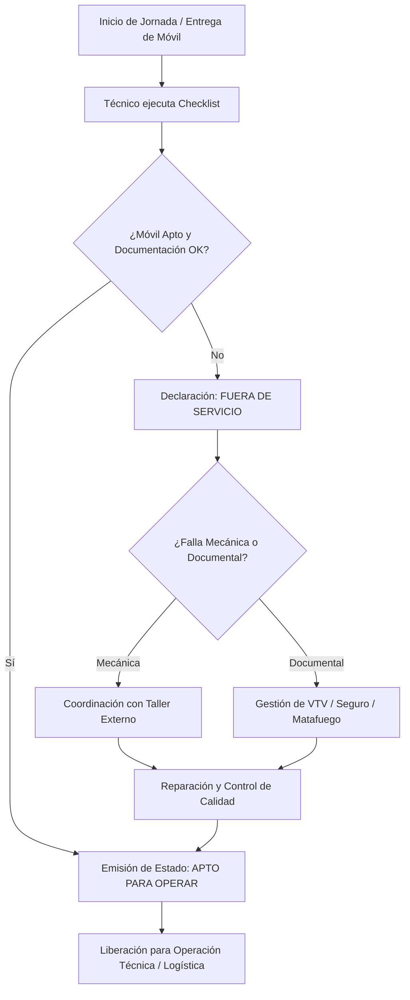

<button onclick="window.print()" class="md-button md-button--primary btn-print" style="margin-bottom: 15px;">
  🖨️ Imprimir / Descargar PDF
</button>

# PROCEDIMIENTO DE CONTROL Y MANTENIMIENTO DE FLOTA VEHICULAR (PR-MVEH-001)

**Norma ISO 9001:2015 - Cláusulas 7.1.3 y 7.1.5** | **Estado:** Borrador | **Versión:** 0.1

---

## 1. Objetivo y Alcance

**Objetivo:** Estandarizar la gestión preventiva, correctiva, documental y de equipamiento de la flota vehicular de Obercom para asegurar la disponibilidad técnica operativa, la seguridad vial y el cumplimiento legal de las unidades.

* **Qué HACE:**
    * Programación y control de mantenimientos preventivos y correctivos (mecánica, neumáticos, fluidos).
    * Control documental integral de las unidades (VTV, seguro, matafuegos, cédula) y validación de licencias de conducir habilitantes.
    * Ejecución y auditoría de checklists de estado general, limpieza, herramientas e insumos a bordo (en coordinación con Mantenimiento de Equipos).
    * Monitoreo, registro y análisis del rendimiento de combustible por unidad (KPL) y declaración del estado de habilitación ("Apto" / "No Apto").
    [VER Mantenimiento de flota de otras sucursales en caso de ser necesario]
    [VER Coordinar servis en otra ciudad]
[VER Accidentes o choques en via publica. como actuar]
[VER Robo o extravio del vehiculo. Daño o Falla en operatividad]
* **Qué NO HACE:**
    * Coordinación de cronogramas de viajes a sucursales, itinerarios o consolidación de cargas (corresponde a Coordinación Logística).
    * Asignación del personal o técnicos para realizar rutas de mantenimiento de red o instalaciones de clientes.
    * Gestión de cobro, pago o descargos administrativos de multas de tránsito.

---

## 2. Matriz RACI y Descripción de Pasos

| Paso | Actividad / Descripción | Responsable (R) | Aprueba (A) | Consultado (C) | Informado (I) |
| :--- | :--- | :--- | :--- | :--- | :--- |
| **1. Checklist y Recepción** | Inspección física/digital del móvil al inicio y fin de turno; registro de novedades físicas o faltantes. | TEC | GFL | - | GSL |
| **2. Control Documental y Elementos** | Verificación de vencimientos (VTV, Seguro, Matafuegos) y estado de licencias de conducir del personal. | GFL | GSL | ADM | TEC |
| **3. Planificación Preventiva** | Programación de service, cambio de fluidos, frenos y neumáticos según kilometraje o ciclo temporal. | GFL | GSL | TAL | - |
| **4. Gestión de Averías y Taller** | Diagnóstico inicial ante fallas, traslado a taller externo, seguimiento de tiempos de parada y recepción conforme. | GFL | GSL | TAL | TEC |
| **5. Control de Combustible (KPL)** | Registro de cargas de combustible, cálculo de Kilómetros Por Litro y detección de desvíos de consumo. | GFL | GSL | - | ADM |
| **6. Habilitación del Activo** | Actualización de la matriz de disponibilidad ("Apto para Operar" / "Fuera de Servicio"). | GFL | GSL | - | CLOG |

*Referencias de Roles:* **GFL:** Gestor de Flota Vehicular | **GSL:** Gerente de Suministros y Logística | **CLOG:** Coordinador Logístico | **TEC:** Técnico / Chofer asignado | **TAL:** Taller Mecánico Proveedor | **ADM:** Administración

---

## 3. Reglas Operativas del Proceso

* **[Regla 1 / Ventana Horaria y Checklists]:** Todo checklist de inicio de turno debe ser completado por el técnico obligatoriamente en los primeros 15 minutos previos a la salida a calle. Cualquier anomalía detectada debe reportarse inmediatamente al Gestor de Flota.
* **[Regla 2 / Bloqueo por Documentación]:** Ningún vehículo con VTV vencida, seguro caduco o extintor fuera de fecha podrá ser marcado como "Apto". El sistema/tablero debe bloquear su asignación automáticamente.
* **[Regla 3 / Control de Conductores]:** El Gestor de Flota debe auditar quincenalmente la vigencia del carnet de conducir de los técnicos habilitados. Técnico con carnet vencido queda inhabilitado de forma preventiva para la toma de móviles.
* **[Regla 4 / Trazabilidad KPL]:** El comprobante de carga de combustible debe incluir de forma obligatoria la foto del odómetro. Desvíos superiores al ±12% respecto al promedio histórico del móvil activarán una revisión técnica.

---

* ## 4. Diagrama de Flujo

---

## 5. Gestión de Excepciones

!!! warning "Avería Crítica en Vía Pública"
    **Escenario:** El vehículo sufre una falla mecánica grave o accidente que invalida su rodaje durante el turno técnico.
    **Acción Correctiva:** El técnico notifica inmediatamente al Gestor de Flota. Este gestiona el auxilio/grúa, asigna un móvil de reserva si hay disponibilidad técnica y clasifica la unidad en el sistema como "En Taller - Novedad Crítica", registrando el tiempo fuera de servicio.

!!! failure "Intento de Salida con Unidad No Apta o Sin Documentación"
    **Escenario:** Un técnico o área intenta utilizar una unidad con estado "Fuera de Servicio" o con documentación vencida.
    **Acción Correctiva:** El Gestor de Flota debe retirar la llave físicamente e inmovilizar la unidad en el tablero operativo. Se emite un reporte inmediato de No Conformidad al Gerente de S&L y al responsable del área que solicitó la unidad.

---

## 6. Indicadores de Gestión (KPIs)

* **Disponibilidad Operativa de la Flota (DOF):**
    * **Fórmula:** `(Total Días-Móvil Disponibles / Total Días-Móvil Teóricos) * 100`
    * **Meta:** `≥ 92%`

* **Rendimiento de Combustible (KPL) por Unidad:**
    * **Fórmula:** `Total Kilómetros Recorridos en el mes / Total Litros Cargados en el mes`
    * **Meta:** `Variación ≤ ±10% respecto al estándar del fabricante / histórico del modelo`

* **Efectividad del Mantenimiento Preventivo (EMP):**
    * **Fórmula:** `(Mantenimientos Preventivos Ejecutados en Fecha / Mantenimientos Preventivos Programados) * 100`
    * **Meta:** `≥ 95%`

---

## 7. Historial de Control de Cambios

| Versión | Fecha | Descripción de la Modificación | Autor |
| :--- | :--- | :--- | :--- |
| 0.1 | 22/08/2026 | Confección del borrador inicial para desvinculación de Flota | Consultoría ISO 9001 / S&L |

