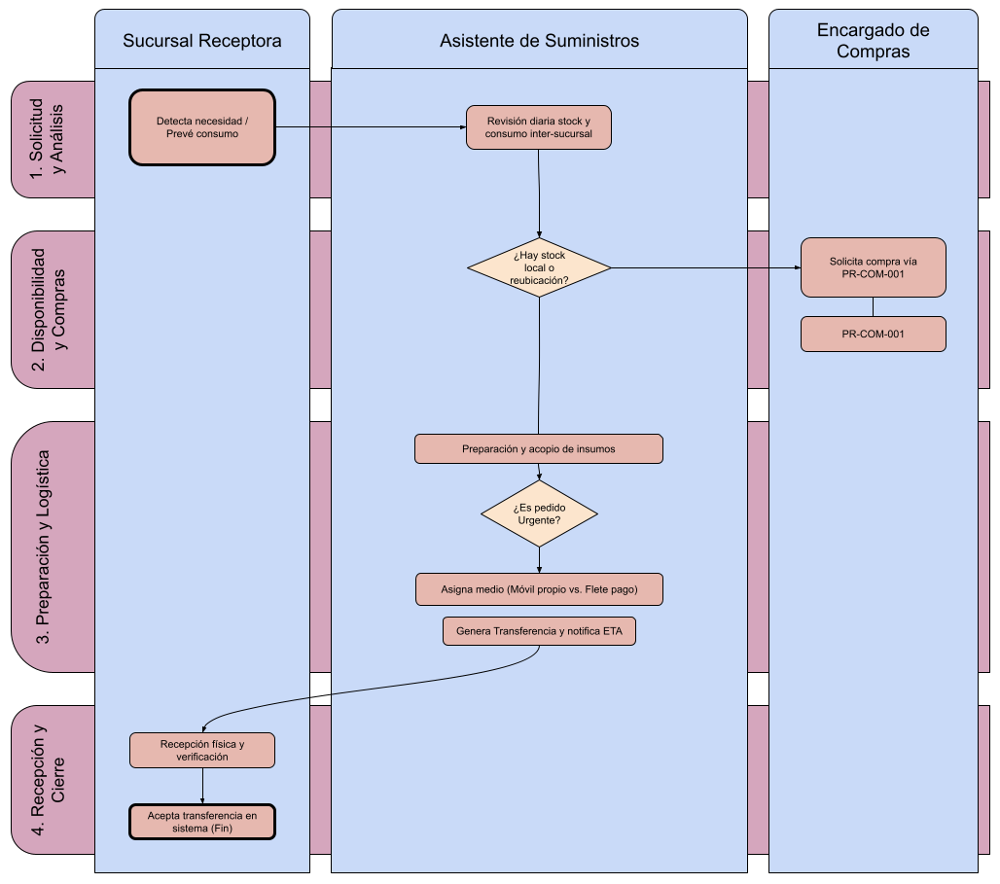

# PREPARADO Y DESPACHO DE PEDIDOS A SUCURSALES (PR-PEDS-001)

**Norma ISO 9001:2015 - Cláusula 8.5.4 (Preservación del Producto)** | **Estado:** Borrador | **Versión:** 0.2

---

## 1. Objetivo y Alcance

**Objetivo:** Normar la detección de necesidades, consolidación, embalaje y transferencia de insumos y equipos desde el Almacén Principal hacia las sucursales descentralizadas (Wanda, San Pedro, Eldorado, Ituzaingó), asegurando un abastecimiento eficiente y el control del inventario.

* **Qué HACE:**
    * Revisa diariamente el stock y procesa los requerimientos o pedidos emitidos por las sucursales.
    * Analiza consumos históricos y disponibilidades en otras plazas para optimizar la redistribución.
    * Prepara y acopia los insumos para su despacho.
    * Define el medio de transporte óptimo (vehículo propio vs. transporte pago) según urgencia, volumen y costo.
    * Genera las transferencias en el sistema de gestión y realiza el seguimiento hasta la confirmación de recepción.
* **Qué NO HACE:**
    * No realiza la auditoría física ni el control de inventarios de los almacenes dentro de las sucursales descentralizadas para detectar faltantes de los mismos (dichas auditorías corresponden al procedimiento PR-AUD y aplican en situaciones distintas).
    * No realiza la gestión de compras directas ni negociación con proveedores (derivado a PR-COM-001).

---

## 2. Matriz RACI y Descripción de Pasos

| Paso | Actividad / Descripción | Responsable (R) | Aprueba (A) | Consultado (C) | Informado (I) |
| :--- | :--- | :--- | :--- | :--- | :--- |
| **1. Detección de Necesidad** | Revisión diaria de stock en sistema (Punto de Pedido) o recepción de solicitud de sucursal por previsión de consumo. | AS | EC | RS | - |
| **2. Análisis de Stock y Consumo** | Evaluación de disponibilidad en Almacén Principal, revisión de exceso de stock en otras sucursales para posible reubicación y análisis de tendencia de uso en el periodo. | AS | EC | RS | - |
| **3. Requerimiento o Compra** | Si no hay stock propio ni en otras sucursales, se activa la solicitud a compras vía PR-COM-001. | AS | EC | - | - |
| **4. Preparación y Acopio** | Recolección, embalaje y acopio de los insumos en el Almacén Principal durante la jornada. | AS | AS | - | - |
| **5. Coordinación Logística** | Definición del método de envío evaluando urgencia, costo, volumen y peso (Móvil propio vs. Transporte pago). | AS | EC | - | - |
| **6. Transferencia y Aviso** | Registro de la transferencia en el sistema. Notificación a la sucursal con fecha y hora estimada de llegada. | AS | - | - | RS |
| **7. Recepción y Cierre** | Recepción física en destino, verificación e ingreso de la conformidad en el sistema por parte de la sucursal. | RS | RS | - | AS |

*Referencias de Roles:* **AS:** Asistente de Suministros | **EC:** Encargado de Compras | **RS:** Responsable de Sucursal

---

## 3. Reglas Operativas del Proceso

* **Regla 1 / Criterio de Transporte:** Como norma general, todo envío no urgente debe programarse aprovechando los viajes de móviles propios de la empresa (directivos, técnicos en ruta, etc.). El pago de transporte externo (mensajería o encomienda) está restringido únicamente a situaciones de urgencia comprobada.
* **Regla 2 / Punto de Pedido y Análisis de Consumo:** La revisión diaria del sistema activa alertas preventivas antes del quiebre de stock. Previo a generar una orden de compra mediante PR-COM-001, es obligatorio ejecutar un doble análisis:
    * **Redistribución entre sucursales:** Si una sucursal registra sobrante o stock inmovilizado de un insumo, se gestiona la transferencia directa entre sucursales antes de comprar nuevo material.
    * **Proyección de demanda:** Se evalúa la estacionalidad y el historial reciente de consumo; un pico eventual no justifica automáticamente una recompra del mismo volumen si la demanda futura proyecta una baja.
* **Regla 3 / Trazabilidad de Inventario:** Ningún insumo o equipo puede salir del Almacén Principal sin su correspondiente comprobante de "Transferencia" emitido en el sistema. El stock permanecerá en estado "en tránsito" hasta la confirmación de la sucursal receptora.

---

## 4. Diagrama de Flujo del Proceso

---

## 5. Gestión de Excepciones

!!! warning "Faltante o Daño en Insumos al Recibir"
    **Escenario:** Al llegar el pedido a la sucursal, se detectan faltantes respecto a la transferencia o insumos dañados por el traslado.
    **Acción Correctiva:** La sucursal no debe aceptar la transferencia completa en el sistema. Informará inmediatamente al Asistente de Suministros (adjuntando evidencia fotográfica) para reajustar el inventario, gestionar la garantía/reclamo y despachar la reposición.

!!! failure "Ausencia Prolongada de Móvil Propio"
    **Escenario:** Existe una necesidad "No Urgente", pero la falta de viajes programados de vehículos de la empresa amenaza con generar un quiebre por demora acumulada.
    **Acción Correctiva:** El Asistente de Suministros escalará el caso al Encargado de Compras para evaluar la autorización extraordinaria de un envío pago o la reprogramación prioritaria de una ruta técnica.

---

## 6. Indicadores de Gestión (KPIs)

* **Ratio de Eficiencia Logística:**
    * **Fórmula:** `(Envíos por móviles propios / Total de envíos realizados) * 100`
    * **Meta:** `≥ 80%`

* **Tiempo de Ciclo de Despacho:**
    * **Fórmula:** `Horas transcurridas desde la detección de la necesidad hasta la entrega al transporte/móvil (con stock disponible).`
    * **Meta:** `≤ 24 horas hábiles`

---

## 7. Historial de Control de Cambios

| Versión | Fecha | Descripción de la Modificación | Autor |
| :--- | :--- | :--- | :--- |
| 0.1 | 08/08/2026 | Confección del borrador inicial. | Suministros / Calidad |
| 0.2 | 10/08/2026 | Inclusión del análisis de stock inter-sucursal, revisión de consumos en Punto de Pedido y delimitación con PR-AUD. | Suministros / Calidad |
