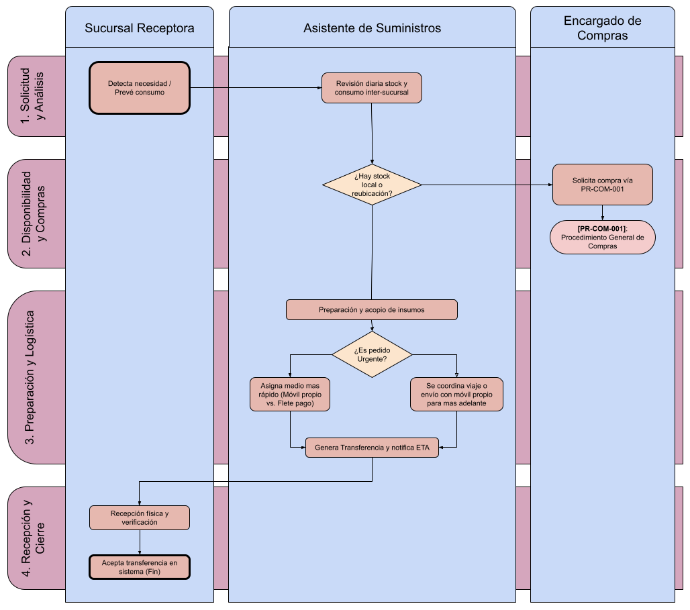

<button onclick="window.print()" class="md-button md-button--primary btn-print" style="margin-bottom: 15px;">
  🖨️ Imprimir / Descargar PDF
</button>

# PREPARADO Y DESPACHO DE PEDIDOS A SUCURSALES (PR-PEDS-001)

**Norma ISO 9001:2015 - Cláusula 8.5.4 (Preservación del Producto)** | **Estado:** Borrador | **Versión:** 0.3

---

## 1. Objetivo y Alcance

**Objetivo:** Normar la detección de necesidades, consolidación, embalaje y transferencia de insumos y equipos desde el Almacén Principal hacia las sucursales descentralizadas (Wanda, San Pedro, Eldorado, Ituzaingó), asegurando un abastecimiento eficiente y el control del inventario.

* **Qué HACE:**
    * Revisa diariamente el stock y procesa los requerimientos o pedidos emitidos por las sucursales.
    * Analiza consumos históricos y disponibilidades en otras plazas para optimizar la redistribución.
    * Prepara y acopia los insumos para su despacho.
    * Define el medio de transporte óptimo (vehículo propio vs. transporte pago) según urgencia, volumen y costo.
    * Genera las transferencias en el sistema de gestión y realiza el seguimiento hasta la confirmación de recepción.
* **Qué NO HACE:**
    * No realiza la auditoría física ni el control de inventarios de los almacenes dentro de las sucursales descentralizadas para detectar faltantes de los mismos (dichas auditorías corresponden al procedimiento PR-AUD y aplican en situaciones distintas).
    * No realiza la gestión de compras directas ni negociación con proveedores (derivado a PR-COM-001).

---

## 2. Matriz RACI y Descripción de Pasos

| Etapa / Paso | Actividades Clave del Paso | Sucursal Receptora (RS) | Asistente de Suministros (AS) | Encargado de Compras (EC) |
| :--- | :--- | :---: | :---: | :---: |
| **1. Solicitud y Análisis** | Detección de necesidades por consumo proyectado o revisión diaria del stock en sistema y consumos inter-sucursal. | **C** *(Detecta necesidad o solicita previsión)* | **R** *(Ejecuta revisión diaria y análisis)* | - |
| **2. Disponibilidad y Compras** | Evaluación de stock en Almacén Principal, análisis de reubicación desde otra sucursal y activación de compra vía PR-COM-001 si hay faltante. | **I** *(Si aplica transferencia inter-sucursal)* | **R** *(Verifica stock, evalúa reubicación y solicita compra)* | **R / A** *(Aprueba y gestiona compra vía PR-COM-001)* |
| **3. Preparación y Logística** | Recolección, embalaje y acopio; asignación de transporte (móvil propio vs. flete pago), generación de transferencia y aviso de ETA. | **I** *(Recibe aviso de despacho y ETA)* | **R** *(Acopia, define logística, genera transferencia y notifica)* | - |
| **4. Recepción y Cierre** | Recepción física en destino, verificación del estado/cantidad de insumos y aceptación formal de la transferencia en el sistema. | **R / A** *(Revisa el pedido y acepta la transferencia)* | **I** *(Recibe confirmación de sistema y cierra el ciclo)* | - |

---

*Referencias de Leyenda:*
* **R (Responsable):** Quien ejecuta las actividades de la celda.
* **A (Aprueba):** Quien valida o autoriza la decisión de la etapa.
* **C (Consultado):** Quien aporta información o requerimientos.
* **I (Informado):** Quien recibe la notificación del estado o resultado.

---

## 3. Reglas Operativas del Proceso

* **Regla 1 / Criterio de Transporte:** Como norma general, todo envío no urgente debe programarse aprovechando los viajes de móviles propios de la empresa (directivos, técnicos en ruta, etc.). El pago de transporte externo (mensajería o encomienda) está restringido únicamente a situaciones de urgencia comprobada.
* **Regla 2 / Punto de Pedido y Análisis de Consumo:** La revisión diaria del sistema activa alertas preventivas antes del quiebre de stock. Previo a generar una orden de compra mediante [PR-COM-001: Procedimiento General de Compras](PR-COM-001.md), es obligatorio ejecutar un doble análisis:
    * **Redistribución entre sucursales:** Si una sucursal registra sobrante o stock inmovilizado de un insumo, se gestiona la transferencia directa entre sucursales antes de comprar nuevo material.
    * **Proyección de demanda:** Se evalúa la estacionalidad y el historial reciente de consumo; un pico eventual no justifica automáticamente una recompra del mismo volumen si la demanda futura proyecta una baja.
* **Regla 3 / Trazabilidad de Inventario:** Ningún insumo o equipo puede salir del Almacén Principal sin su correspondiente comprobante de "Transferencia" emitido en el sistema. El stock permanecerá en estado "en tránsito" hasta la confirmación de la sucursal receptora.

---

## 4. Diagrama de Flujo del Proceso

---

## 5. Gestión de Excepciones

!!! warning "Faltante o Daño en Insumos al Recibir"
    **Escenario:** Al llegar el pedido a la sucursal, se detectan faltantes respecto a la transferencia o insumos dañados por el traslado.
    **Acción Correctiva:** La sucursal no debe aceptar la transferencia completa en el sistema. Informará inmediatamente al Asistente de Suministros (adjuntando evidencia fotográfica) para reajustar el inventario, gestionar la garantía/reclamo y despachar la reposición.

!!! failure "Ausencia Prolongada de Móvil Propio"
    **Escenario:** Existe una necesidad "No Urgente", pero la falta de viajes programados de vehículos de la empresa amenaza con generar un quiebre por demora acumulada.
    **Acción Correctiva:** El Asistente de Suministros escalará el caso al Encargado de Compras para evaluar la autorización extraordinaria de un envío pago o la reprogramación prioritaria de una ruta técnica.

---

## 6. Indicadores de Gestión (KPIs)

* **Ratio de Eficiencia Logística:**
    * **Fórmula:** `(Envíos por móviles propios / Total de envíos realizados) * 100`
    * **Meta:** `≥ 80%`

* **Tiempo de Ciclo de Despacho:**
    * **Fórmula:** `Horas transcurridas desde la detección de la necesidad hasta la entrega al transporte/móvil (con stock disponible).`
    * **Meta:** `≤ 24 horas hábiles`

---

## 7. Historial de Control de Cambios

| Versión | Fecha | Descripción de la Modificación | Autor |
| :--- | :--- | :--- | :--- |
| 0.1 | 08/08/2026 | Confección del borrador inicial. | Suministros / Calidad |
| 0.2 | 10/08/2026 | Inclusión del análisis de stock inter-sucursal, revisión de consumos en Punto de Pedido y delimitación con PR-AUD. | Suministros / Calidad |
| 0.3 | 07/10/2026 | Reestructuración de la Matriz RACI en 4 etapas principales alineadas al gráfico de flujo por carriles/roles. | Suministros / Calidad |
