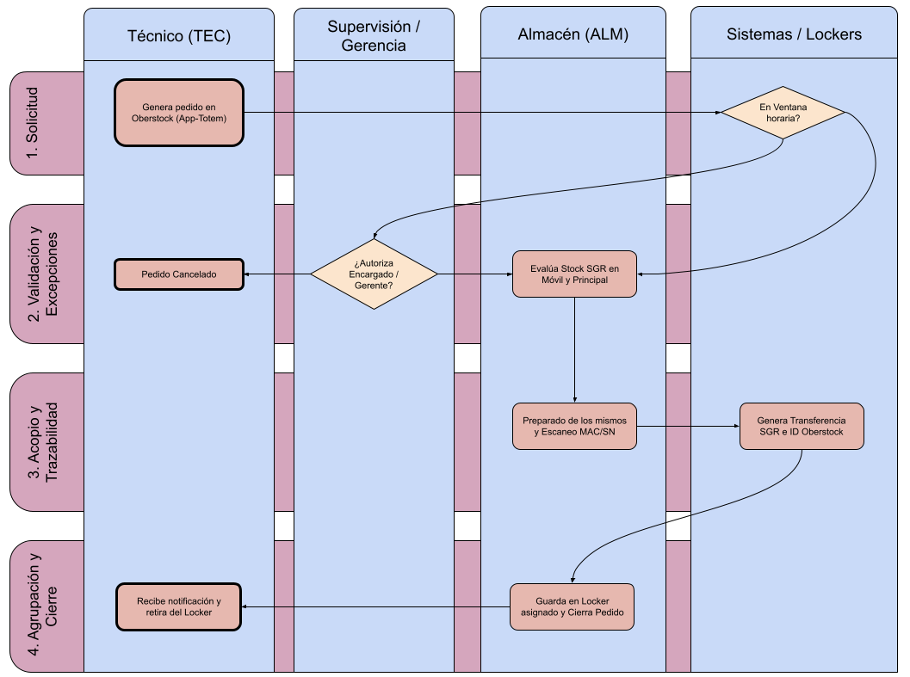

# Procedimiento de Preparado de Pedidos para Técnicos de Calle (PR-PEDT-001)

**Norma ISO 9001:2015** | **Estado:** Borrador de Trabajo | **Versión:** 0.1 | **Fecha:** 04/08/2026[cite: 2]

---

## 1. Objetivo y Alcance

**Objetivo:** Estandarizar la recepción, auditoría de stock, armado y asignación diferida de equipos y materiales solicitados por los técnicos de calle, garantizando la trazabilidad de seriales y la transferencia sistémica entre el Almacén Principal y los Almacenes Móviles[cite: 2].

* **Qué HACE este procedimiento:**
    * Evaluación de solicitudes en el sistema Oberstock contra el stock real del técnico en el sistema SGR[cite: 2].
    * Acopio físico de materiales[cite: 2].
    * Escaneo unitario de MAC/SN (Serial Number) de los equipos[cite: 2].
    * Emisión e incorporación de la ID de Transferencia de SGR dentro de Oberstock[cite: 2].
    * Acopio de insumos en lockers rotulados[cite: 2].
    * Registro final del número de locker en el sistema para el cierre del pedido[cite: 2].
* **Qué NO HACE este procedimiento:**
    * Entrega presencial mano a mano fuera del sistema de lockers[cite: 2].
    * Despacho de solicitudes fuera del régimen estricto de horarios (salvo excepciones con autorización previa)[cite: 2].
    * Asignación de órdenes de trabajo de campo a los técnicos[cite: 2].

---

## 2. Matriz RACI y Descripción de Pasos

| Paso | Descripción de la Actividad | Responsable (R) | Aprueba (A) | Consultado (C) | Informado (I) |
| :--- | :--- | :--- | :--- | :--- | :--- |
| **1. Emisión del Pedido** | Ingreso de la Orden de Pedido en Oberstock respetando la ventana horaria según el turno del técnico[cite: 2]. | TEC | TEC | - | ALM |
| **2. Evaluación de Stock** | Revisión de lo solicitado en Oberstock y consulta del stock actual del TEC en SGR[cite: 2]. Validación de topes, pertinencia e inventario en Almacén Principal[cite: 2]. | ALM | ALM | - | TEC |
| **3. Acopio y Escaneo** | Picking físico de materiales[cite: 2]. Escaneo unitario obligatorio de MAC o Serial Number (SN) de los equipos[cite: 2]. | ALM | ALM | TEC | - |
| **4. Transferencia SGR** | Generación de la transferencia en SGR (Almacén Principal -> Almacén Móvil TEC)[cite: 2]. Registro de la ID de Transferencia dentro de Oberstock[cite: 2]. | ALM | ALM | - | - |
| **5. Staging y Cierre** | Depósito de insumos en el locker individual rotulado[cite: 2]. Registro del N° de Locker en Oberstock y cierre formal de la orden[cite: 2]. | ALM | ALM | - | TEC |

*Referencias de Roles:* **TEC:** Técnico de Calle | **ALM:** Personal de Almacén[cite: 2]

---

## 3. Reglas Operativas y Cronograma de Preparación

* **Régimen Estricto de Pedido por Horario:**
    * **Técnicos de ingreso 7:30 AM:** Generan su pedido en Oberstock al finalizar la jornada del día hábil anterior[cite: 2].
    * **Técnicos de ingreso 10:00 AM:** Generan su pedido al finalizar la jornada previa[cite: 2]. El personal de Almacén procesa y arma sus pedidos dentro de la franja de 7:30 AM a 10:00 AM del mismo día[cite: 2].
* **Criterio de Evaluación de Stock:** ALM rechazará o ajustará las cantidades solicitadas si el sistema SGR indica que el TEC posee stock suficiente en su móvil, si el insumo no corresponde a su tarea/perfil, o ante desabastecimiento en Almacén Principal[cite: 2].
* **Trazabilidad Unitaria (MAC/SN):** La lectura por scanner de cada MAC/SN es un requisito excluyente en el acopio para imputar el equipo al móvil del técnico y permitir su posterior descuento automático al instalarlo al cliente[cite: 2].

---

## 4. Diagrama de Flujo del Proceso

---

## 5. Gestión de Excepciones

!!! warning "Excepción 1: Insumo desproporcionado o exceso de stock en móvil"
    **Escenario:** El TEC solicita 10 ONUs pero SGR refleja que ya tiene 7 unidades sin instalar en su vehículo[cite: 2].  
    **Acción Correctiva:** ALM ajusta la cantidad en Oberstock a 3 unidades, coloca la observación explícita "Ajuste por cupo en móvil" y procesa el pedido de manera parcial[cite: 2].

!!! failure "Excepción 2: Serie/MAC con etiqueta dañada o ilegible"
    **Escenario:** Un equipo físico no puede ser escaneado durante la fase de acopio por problemas en su etiqueta[cite: 2].  
    **Acción Correctiva:** El equipo NO se entrega[cite: 2]. Se deriva de inmediato al área de diagnóstico/re-etiquetado según el procedimiento [PR-REC-001](PR-REC-001.md) y se reemplaza en el pedido por otra unidad con etiqueta legible[cite: 2].

!!! note "Excepción 3: Insumo sin existencia en Almacén Principal"
    **Escenario:** No hay stock físico disponible en el Almacén Principal para cubrir la solicitud del técnico[cite: 2].  
    **Acción Correctiva:** ALM descuenta el ítem faltante en Oberstock, notifica al técnico a través de la plataforma y activa el requerimiento de reposición hacia Compras según el procedimiento [PR-COM-001](PR-COM-001.md)[cite: 2].

!!! danger "Excepción 4a: Pedido fuera de régimen para técnicos propios de la empresa (Emergencias o Guardias)"
    **Escenario:** El técnico requiere materiales urgentes en un horario fuera de la ventana estipulada de armado o por fuerza mayor[cite: 2].  
    **Acción Correctiva:** Requiere la validación previa del Encargado de Técnicos o Gerente de CAT[cite: 2]. Sin dicha aprobación digital y formal, Almacén no procesa la orden[cite: 2]. El pedido debe ser generado igualmente por Oberstock para su registro[cite: 2].

!!! danger "Excepción 4b: Pedido fuera de régimen para técnicos tercerizados"
    **Escenario:** El técnico requiere materiales urgentes en un horario fuera de la ventana estipulada de armado o por fuerza mayor[cite: 2].  
    **Acción Correctiva:** Requiere la validación y autorización por parte del Gerente de CAT[cite: 2]. Sin dicha aprobación digital y formal, Almacén no procesa la orden[cite: 2]. El pedido debe ser generado igualmente por Oberstock para su registro[cite: 2].

---

## 6. Indicadores de Gestión (KPIs)

* **Cantidad de Pedidos Mensuales:**  
  * **Descripción:** Contabilización del total de pedidos realizados en el transcurso de 1 mes[cite: 2].
* **Cantidad de Pedidos Fuera de Régimen o Urgentes:**  
  * **Descripción:** Pedidos no realizados de manera adecuada en tiempo y forma (autorizados excepcionalmente por Encargado de Técnicos o Gerente de CAT)[cite: 2].  
  * **Meta:** Menos de 20 por mes[cite: 2].
* **Tiempo Promedio de Preparado de Pedidos:**  
  * **Descripción:** Tiempo desde el inicio de la preparación hasta dejar el pedido listo en el locker, incluyendo modificaciones y transferencias en sistemas internos[cite: 2].  
  * **Meta:** Menor a 10 minutos por pedido[cite: 2].

---

## 7. Historial de Control de Cambios

| Versión | Fecha | Descripción de la Modificación | Autor |
| :--- | :--- | :--- | :--- |
| 0.1 | 04/08/2026 | Confección del borrador inicial del procedimiento | Almacén / Suministros y Logística[cite: 2] |
