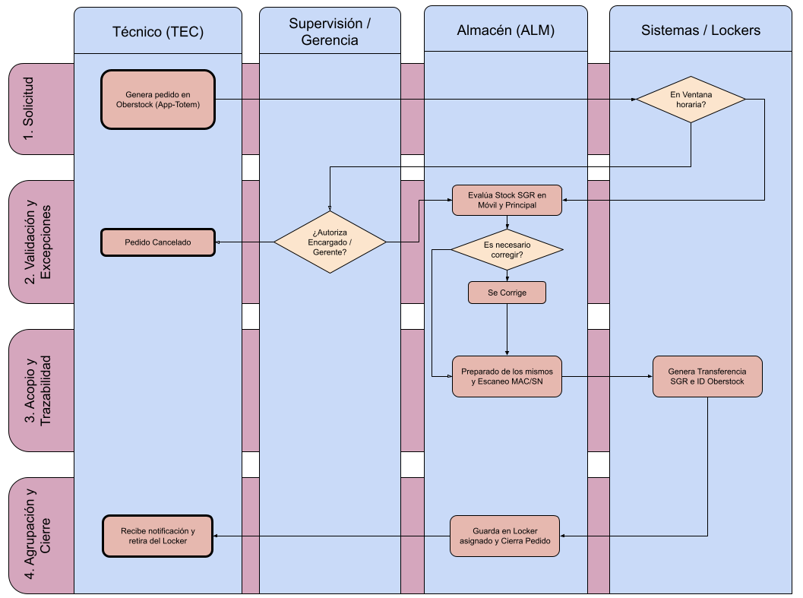

<button onclick="window.print()" class="md-button md-button--primary btn-print" style="margin-bottom: 15px;">
  🖨️ Imprimir / Descargar PDF
</button>

# Procedimiento de Preparado de Pedidos para Técnicos de Calle (PR-PEDT-001)

**Norma ISO 9001:2015 - Cláusula 8.5** | **Estado:** Borrador de Trabajo | **Versión:** 0.2 | **Fecha:** 07/10/2026

---

## 1. Objetivo y Alcance

**Objetivo:** Estandarizar la recepción, auditoría de stock, armado y asignación diferida de equipos y materiales solicitados por los técnicos de calle, garantizando la trazabilidad de seriales y la transferencia sistémica entre el Almacén Principal y los Almacenes Móviles.

* **Qué HACE este procedimiento:**
    * Evaluación de solicitudes en el sistema Oberstock contra el stock real del técnico en el sistema SGR.
    * Acopio físico de materiales.
    * Escaneo unitario de MAC/SN (Serial Number) de los equipos.
    * Emisión e incorporación de la ID de Transferencia de SGR dentro de Oberstock.
    * Acopio de insumos en lockers rotulados.
    * Registro final del número de locker en el sistema para el cierre del pedido.
* **Qué NO HACE este procedimiento:**
    * Entrega presencial mano a mano fuera del sistema de lockers.
    * Despacho de solicitudes fuera del régimen estricto de horarios (salvo excepciones con autorización previa).
    * Asignación de órdenes de trabajo de campo a los técnicos.

---

## 2. Matriz RACI y Descripción de Pasos

| Paso / Actividad | Técnico (TEC) | Supervisión / Gerencia / CCT | Almacén (ALM) | Sistemas / Lockers |
| :--- | :---: | :---: | :---: | :---: |
| **1. Solicitud:** Emisión del pedido en Oberstock y verificación automática de ventana horaria. | **R** | - | **I** | **A** |
| **2. Validación y Excepciones:** Autorización de pedidos fuera de régimen por CCT/CAT, auditoría de stock en SGR y ajuste de cantidades. | **I** | **A** | **R** | - |
| **3. Acopio y Trazabilidad:** Picking físico, escaneo unitario obligatorio de MAC/SN y generación de transferencia sistémica en SGR. | - | - | **R / A** | - |
| **4. Agrupación y Cierre:** Guardado en locker asignado, cierre formal en Oberstock, notificación y retiro por el técnico. | **R** | - | **A** | -|

*Referencias de Leyenda RACI:* **R:** Responsable de ejecutar la actividad | **A:** Aprueba / Rinde cuentas | **C:** Consultado (aporta datos/sistemas) | **I:** Informado (recibe notificación/resultado)

*Referencias de Roles:* **TEC:** Técnico de Calle | **Supervisión / Gerencia / CCT:** Encargado de Técnicos, CCT o Gerente de CAT | **ALM:** Personal de Almacén | **Sistemas / Lockers:** Plataforma Oberstock, SGR y lockers físicos.

---

## 3. Reglas Operativas y Cronograma de Preparación

* **Régimen Estricto de Pedido por Horario:**
    * **Técnicos de ingreso 7:30 AM:** Generan su pedido en Oberstock dentro de la ventana ordinaria (hasta las 18:30 hs del día hábil anterior).
    * **Técnicos de ingreso 10:00 AM:** Generan su pedido al finalizar su jornada previa (incluso si ingresa posteriormente a las 18:30 hs). El personal de Almacén procesa y arma sus pedidos dentro de la franja de 7:30 AM a 10:00 AM del mismo día de ingreso.
* **Criterio de Evaluación de Stock:** ALM rechazará o ajustará las cantidades solicitadas si el sistema SGR indica que el TEC posee stock suficiente en su móvil, si el insumo no corresponde a su tarea/perfil, o ante desabastecimiento en Almacén Principal.
* **Trazabilidad Unitaria (MAC/SN):** La lectura por scanner de cada MAC/SN es un requisito excluyente en el acopio para imputar el equipo al móvil del técnico y permitir su posterior descuento automático al instalarlo al cliente.

---

## 4. Diagrama de Flujo del Proceso

---

## 5. Gestión de Excepciones

!!! warning "Excepción 1: Insumo desproporcionado o exceso de stock en móvil"
    **Escenario:** El TEC solicita 10 ONUs pero SGR refleja que ya tiene 7 unidades sin instalar en su vehículo.  
    **Acción Correctiva:** ALM ajusta la cantidad en Oberstock a 3 unidades, coloca la observación explícita "Ajuste por cupo en móvil" y procesa el pedido de manera parcial.

!!! failure "Excepción 2: Serie/MAC con etiqueta dañada o ilegible"
    **Escenario:** Un equipo físico no puede ser escaneado durante la fase de acopio por problemas en su etiqueta.  
    **Acción Correctiva:** El equipo NO se entrega. Se deriva de inmediato al área de diagnóstico/re-etiquetado según el procedimiento [PR-REC-001](PR-REC-001.md) y se reemplaza en el pedido por otra unidad con etiqueta legible.

!!! note "Excepción 3: Insumo sin existencia en Almacén Principal"
    **Escenario:** No hay stock físico disponible en el Almacén Principal para cubrir la solicitud del técnico.  
    **Acción Correctiva:** ALM descuenta el ítem faltante en Oberstock, notifica al técnico a través de la plataforma y activa el requerimiento de reposición hacia Compras según el procedimiento [PR-COM-001](PR-COM-001.md).

!!! danger "Excepción 4a: Pedido fuera de régimen para técnicos propios de la empresa (Emergencias o Guardias)"
    **Escenario:** El técnico requiere materiales urgentes en un horario fuera de la ventana estipulada de armado o por fuerza mayor.  
    **Acción Correctiva:** Requiere la validación previa del CCT, Encargado de Técnicos o Gerente de CAT. Sin dicha aprobación digital y formal, Almacén no procesa la orden. El pedido debe ser generado igualmente por Oberstock para su registro.

!!! danger "Excepción 4b: Pedido fuera de régimen para técnicos tercerizados"
    **Escenario:** El técnico requiere materiales urgentes en un horario fuera de la ventana estipulada de armado o por fuerza mayor.  
    **Acción Correctiva:** Requiere la validación y autorización por parte del CCT o Gerente de CAT. Sin dicha aprobación digital y formal, Almacén no procesa la orden. El pedido debe ser generado igualmente por Oberstock para su registro.

---

## 6. Indicadores de Gestión (KPIs)

* **Cantidad de Pedidos Mensuales:**
    * **Fórmula:** `Sumatoria total de pedidos realizados en el transcurso de 1 mes`
    * **Meta:** `Informativa`

* **Cantidad de Pedidos Fuera de Régimen o Urgentes:**
    * **Fórmula:** `Sumatoria de pedidos autorizados por fuera de la ventana horaria`
    * **Meta:** `< 20 por mes`

* **Tiempo Promedio de Preparado de Pedidos:**
    * **Fórmula:** `Tiempo desde inicio de preparación hasta asignación lista en locker`
    * **Meta:** `< 10 minutos por pedido`

---

## 7. Historial de Control de Cambios

| Versión | Fecha | Descripción de la Modificación | Autor |
| :--- | :--- | :--- | :--- |
| 0.1 | 04/08/2026 | Confección del borrador inicial del procedimiento | Almacén / Suministros y Logística |
| 0.2 | 07/10/2026 | Alineación con Memorándum Operativo: ajuste de roles aprobadores (CCT/CAT) y aclaración de ventanas de armado según turno | Almacén / Suministros y Logística |
