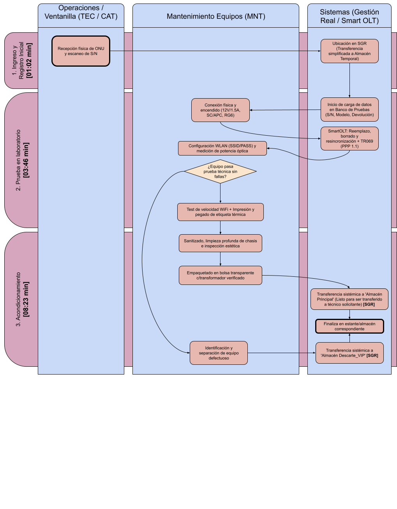

# Procedimiento de Recupero de Equipos (PR-REC-001)

**Norma ISO 9001:2015 - Cláusulas 8.5 / 8.7** | **Estado:** Borrador de Trabajo | **Versión:** 0.1

---

## 1. Objetivo y Alcance

**Objetivo:** Estandarizar y controlar la recepción, diagnóstico técnico, acondicionamiento y actualización sistémica de los equipos de telecomunicaciones recuperados, garantizando la exactitud entre el inventario físico y los sistemas de gestión.

* **Qué HACE:**
    * Recepción física de los equipos entregados por los técnicos de campo tras la ejecución de una baja o recambio.
    * Inspección, diagnóstico básico, limpieza, desinfección y puesta en valor estético de los equipos devueltos.
    * Actualización de firmware (flasheo) y reseteo de parámetros para asegurar la operatividad de los dispositivos.
    * Verificación y actualización del estado del equipo en los sistemas de gestión (Gestión Real) y plataformas tecnológicas (Smart OLT).
    * Reingreso del equipo al stock operativo (Almacén Principal) o disposición final por obsolescencia/daño (Almacén Descarte).
* **Qué NO HACE:**
    * Recepción de la solicitud de baja, retención y coordinación telefónica con el cliente (Responsabilidad de CX-CAT).
    * La visita al domicilio, desinstalación y el retiro físico del equipamiento (Responsabilidad de Técnico de retiro-CAT).
    * Cese de facturación y cierres de cuentas corrientes de clientes (Responsabilidad de Administración y Finanzas).

---

## 2. Documentos Relacionados y Referencias

Este procedimiento interactúa y se complementa con la siguiente información documentada:

* 📄 **[DG-EQU-001: OPTIMIZACIÓN Y AUDITORÍA EN BANCO DE PRUEBAS](../diagnosticos/DG-EQU-001.md)**: Detalla los parámetros técnicos de aceptación y rechazo general de equipamiento.

---

## 3. Matriz RACI y Descripción de Pasos

| Paso | Actividad / Descripción | Responsable (R) | Aprueba (A) | Consultado (C) | Informado (I) |
| :--- | :--- | :--- | :--- | :--- | :--- |
| **1. Recepción física** | Recepción en depósito de los equipos devueltos por técnicos de campo o ventanilla. | TEC / CAT | MNT | - | - |
| **2. Desvinculación y pase a Devoluciones** | Desvinculación en Smart OLT y Gestión Real. Transferencia de stock en sistema al "Almacén Devoluciones". | MNT | MNT | - | - |
| **3. Triaje y diagnóstico** | Clasificación visual por modelo y prueba funcional (encendido/puertos) de los modelos viables. | MNT | MNT | TEC | - |
| **4. Reacondicionamiento** | Limpieza exterior, desinfección y reseteo a valores de fábrica de unidades confirmadas viables. | MNT | MNT | - | - |
| **5. Ingreso a Almacén Principal** | Transferencia física y sistémica de los equipos reacondicionados al "Almacén Principal" para su reutilización. | MNT | MNT | - | - |
| **6. Traspaso a Descarte** | Registro sistémico y traslado físico al "Almacén Descarte" del remanente obsoleto o defectuoso. | MNT | MNT | - | - |

*Referencias de Roles:* **TEC:** Técnico de Campo (Operaciones) | **CAT:** Call Center / Atención al Cliente / Ventanilla | **MNT:** Personal de Mantenimiento del Equipamiento (Suministros y Logística)

---

## 4. Reglas Operativas del Proceso

* **Regla 1 / Ventana Horaria de Procesamiento:** El triaje, diagnóstico y acondicionamiento de los equipos recibidos debe ejecutarse dentro de las 48 horas hábiles posteriores a su ingreso físico en el depósito de Suministros.
* **Regla 2 / Trazabilidad Sistémica Estricta:** Todo movimiento físico de los equipos (a Devoluciones, Principal o Descarte) debe estar respaldado por su correspondiente transferencia en tiempo real en Gestión Real y Smart OLT. El inventario físico debe coincidir al 100% con el sistema.

---

## 5. Diagrama de Flujo del Proceso

---

## 6. Gestión de Excepciones

!!! warning "Excepción 1: Inconsistencia de Trazabilidad en Sistema (Serial no coincide o no existe)"
    **Escenario:** El equipo ingresa físicamente, pero su número de serie no coincide con la orden de baja, figura asignado aún al cliente/almacén del técnico, o no existe en la base de datos.
    **Acción Correctiva:** Si figura en almacén TEC o cliente, MNT notifica la inconsistencia al área CAT para regularizar el traspaso sistémico. Si no existe, MNT realiza el alta e ingreso manual del serial en Gestión Real y ejecuta el flujo estándar de pruebas.

!!! warning "Excepción 2: Equipo recibido sin rotulación o etiqueta ilegible"
    **Escenario:** La etiqueta con el número de serie o MAC está dañada, removida o es ilegible.
    **Acción Correctiva:** MNT conecta el equipo por interfaz lógica (Ethernet/consola) para identificar el serial/MAC internamente. Si responde, reetiqueta la unidad. Si no responde, se deriva a Descarte.

!!! warning "Excepción 3: Equipo viable con faltantes de accesorios (fuente)"
    **Escenario:** La unidad principal (ONU/router) está operativa, pero ingresa sin su fuente de alimentación original.
    **Acción Correctiva:** MNT aprueba la viabilidad del equipo y solicita la asignación de una fuente compatible desde el stock de repuestos para completar el kit antes del reingreso al Almacén Principal.

!!! failure "Excepción 4: Equipo con daño físico o deterioro estético irrecuperable"
    **Escenario:** El equipo ingresa roto, con partes faltantes, señales de cortocircuito, o suciedad extrema/manchas irremovibles.
    **Acción Correctiva:** El equipo es rechazado y calificado como "No Viable" inmediatamente. MNT ejecuta el traspaso sistémico y traslado físico directo al "Almacén Descarte".

---

## 7. Indicadores de Gestión (KPIs)

* **Cantidad de Equipos Recuperados (CER):**
    * **Fórmula:** `Sumatoria total de unidades físicas recibidas en Almacén Devoluciones`
    * **Meta:** `Alineado al volumen de bajas mensuales`

* **Cantidad de Equipos Fuera de Circulación (CEFC):**
    * **Fórmula:** `Sumatoria total de unidades transferidas al Almacén Descarte`
    * **Meta:** `≤ 15% del total recibido`

* **Cantidad de Equipos Puestos en Circulación (CEPC):**
    * **Fórmula:** `Sumatoria total de unidades transferidas al Almacén Principal`
    * **Meta:** `≥ 85% de los equipos viables recibidos`

* **Porcentaje de Recupero Viable (PRV):**
    * **Fórmula:** `(Cantidad de equipos viables puestos en circulación / Total de viables recibidos) × 100`
    * **Meta:** `≥ 90%`

* **Valor Efectivo Recuperado (VER):**
    * **Fórmula:** `Σ (Equipos viables recuperados por modelo × Precio de mercado actual)`
    * **Meta:** `Maximizar ahorro de capital`
---

## 8. Historial de Control de Cambios

| Versión | Fecha | Descripción de la Modificación | Autor |
| :--- | :--- | :--- | :--- |
| 0.1 | 10/08/2026 | Confección del borrador inicial adaptado a las responsabilidades de Mantenimiento de Equipos. | Suministros y Logística |
