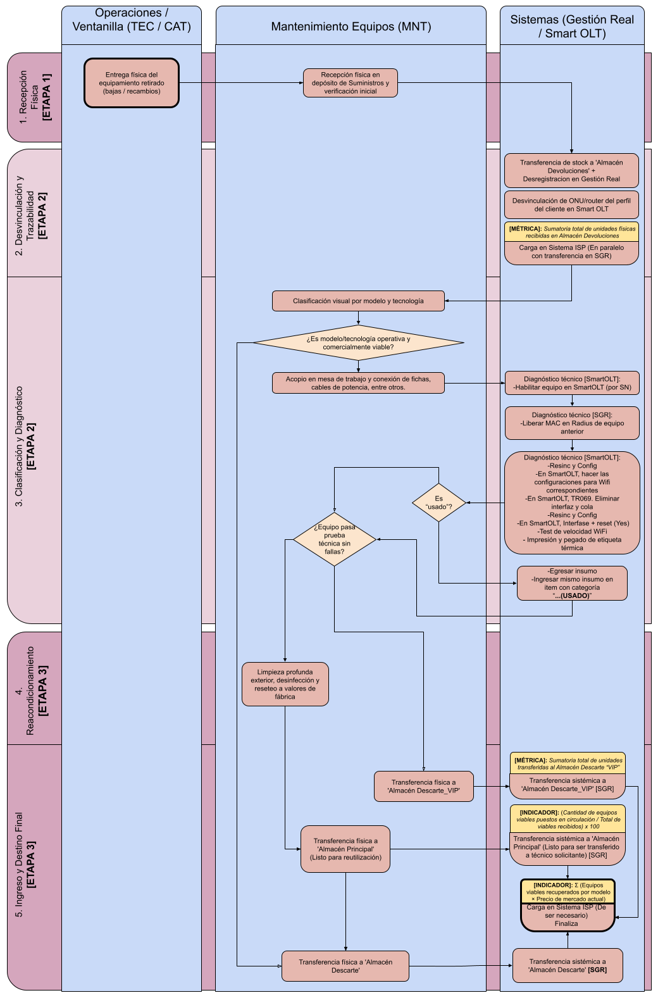

<button onclick="window.print()" class="md-button md-button--primary btn-print" style="margin-bottom: 15px;">
  🖨️ Imprimir / Descargar PDF
</button>

# Procedimiento de Recupero de Equipos (PR-REC-001)

**Norma ISO 9001:2015 - Cláusulas 8.5 / 8.7** | **Estado:** Borrador de Trabajo | **Versión:** 0.2

---

## 1. Objetivo y Alcance

**Objetivo:** Estandarizar y controlar la recepción, desvinculación sistémica, diagnóstico técnico, reacondicionamiento y destino final de los equipos de telecomunicaciones recuperados, garantizando la exactitud del inventario físico contra los sistemas de gestión y plataformas tecnológicas del ISP.

* **Qué HACE:**
    * **Recepción Física (Etapa 1):** Control y verificación inicial en depósito de los equipos entregados por técnicos de campo (bajas/recambios) o devueltos por ventanilla.
    * **Desvinculación y Trazabilidad (Etapa 2):** Desregistración del cliente en Gestión Real (SGR), desvinculación lógica de la ONU/router en Smart OLT, transferencia sistémica a "Almacén Devoluciones" y registro en Sistema ISP de equipos fisicos recibidos.
    * **Clasificación y Diagnóstico (Etapa 2):** Triaje de viabilidad comercial/técnica, liberación de MAC en servidor Radius, diagnóstico lógico y pruebas de velocidad/WiFi en Smart OLT, e impresión y pegado de etiqueta térmica de equipos físicos recibidos.
    * **Reacondicionamiento (Etapa 3):** Limpieza profunda exterior, desinfección, reseteo de parámetros a valores de fábrica y recategorización del activo a ítem con categoría "(USADO)".
    * **Ingreso y Destino Final (Etapa 3):** Transferencia física y registro sistémico (en SGR y Sistema ISP) hacia su ubicación definitiva: **Almacén Principal** (reutilización), **Almacén Descarte_VIP** o **Almacén Descarte**.
* **Qué NO HACE:**
    * Recepción de la solicitud de baja, retención comercial y coordinación telefónica con el cliente (Responsabilidad de CAT / CX / Cobranzas).
    * Visita al domicilio, desinstalación y retiro físico del equipamiento (Responsabilidad de Técnicos de Campo / Contratistas).
    * **Desvinculación sistémica de equipos NO recibidos físicamente:** No ejecuta la desregistración en Gestión Real (SGR) ni la baja lógica en Smart OLT para casos donde el equipo no ingresó al depósito (equipos declarados obsoletos en sitio, no recuperados por cliente inubicable o retenidos por el usuario). La baja sistémica de estos casos es responsabilidad exclusiva del área que gestiona el cierre del caso (CAT / CX / Cobranzas).
    * Cese de facturación, cierres de cuentas corrientes y liquidación contable del cliente (Responsabilidad de Administración y Finanzas).

---

## 2. Matriz RACI y Descripción de Pasos

*(Premisa: Post entrega de equipamiento devuelto o retirado por técnicos de campo o ventanilla).*

| Etapa del Flujo / Actividad | Operaciones / Ventanilla (TEC / CAT) | Mantenimiento Equipos (MNT) | Sistemas (Gestión Real / Smart OLT) |
| :--- | :---: | :---: | :---: |
| **1. Recepción Física [ETAPA 1]** Entrega física del equipamiento retirado (bajas/recambios) por campo o ventanilla y recepción en depósito con verificación inicial. | **R** | **R / A** | - |
| **2. Desvinculación y Trazabilidad [ETAPA 2]** Desvinculación lógica de ONU/router del perfil de cliente en Smart OLT, desregistración en SGR, transferencia a "Almacén Devoluciones" y carga en Sistema ISP de equipos físicos recibidos. | - | **R / A** | - |
| **3. Clasificación y Diagnóstico [ETAPA 2]** Triaje de viabilidad comercial/técnica, liberación de MAC en Radius, pruebas en Smart OLT (WiFi/TR069), impresión/pegado de etiqueta térmica de equipos físicos recibidos y egreso/reingreso sistémico a ítem categoría "(USADO)". | - | **R / A** | - |
| **4. Reacondicionamiento [ETAPA 3]** Limpieza profunda exterior, desinfección y reseteo de parámetros a valores de fábrica de unidades confirmadas viables. | - | **R / A** | - |
| **5. Ingreso y Destino Final [ETAPA 3]** Transferencia física y registro sistémico (en SGR y Sistema ISP) hacia Almacén Principal, Almacén Descarte_VIP o Almacén Descarte. | - | **R / A** | - |

*Leyenda:* **R:** Responsable de ejecución | **A:** Aprueba / Responsable final del resultado | **-:** Sin intervención en la actividad

---

## 3. Reglas Operativas del Proceso

* **Regla 1 / Ventana Horaria de Procesamiento:** El triaje, diagnóstico y acondicionamiento de los equipos recibidos debe ejecutarse dentro de las 48 horas hábiles posteriores a su ingreso físico en el depósito de Suministros.
* **Regla 2 / Trazabilidad Sistémica Estricta:** Todo movimiento físico de equipos (a Devoluciones, Principal, Descarte_VIP o Descarte) debe estar respaldado por su correspondiente transferencia en tiempo real en Gestión Real, Smart OLT y Sistema ISP. El inventario físico debe coincidir al 100% con el sistema.
* **Regla 3 / Condición de Presencia Física:** Mantenimiento de Equipos (S&L) procesa y desvincula en sistemas **únicamente** los equipos que hayan ingresado físicamente al depósito. Equipos no recuperados en domicilio o calificados como obsoletos en sitio sin retiro no son procesados por este procedimiento.

---

## 4. Diagrama de Flujo

---

## 5. Gestión de Excepciones

!!! warning "Excepción 1: Inconsistencia de Trazabilidad en Sistema (Serial no coincide o no existe)"
    **Escenario:** El equipo ingresa físicamente, pero su número de serie no coincide con la orden de baja, figura asignado aún al cliente/almacén del técnico, o no existe en la base de datos.
    **Acción Correctiva:** Si figura en almacén TEC o cliente, MNT notifica la inconsistencia al área CAT para regularizar el traspaso sistémico. Si no existe, MNT realiza el alta e ingreso manual del serial en Gestión Real y ejecuta el flujo estándar de pruebas.

!!! warning "Excepción 2: Equipo recibido sin rotulación o etiqueta ilegible"
    **Escenario:** La etiqueta con el número de serie o MAC está dañada, removida o es ilegible.
    **Acción Correctiva:** MNT conecta el equipo por interfaz lógica (Ethernet/consola) para identificar el serial/MAC internamente. Si responde, reetiqueta la unidad; si no responde, se deriva a Almacén Descarte.

!!! warning "Excepción 3: Equipo viable con faltantes de accesorios (fuente)"
    **Escenario:** La unidad principal (ONU/router) está operativa, pero ingresa sin su fuente de alimentación original.
    **Acción Correctiva:** MNT aprueba la viabilidad del equipo y solicita la asignación de una fuente compatible desde el stock de repuestos para completar el kit antes del reingreso al Almacén Principal.

!!! failure "Excepción 4: Equipo con daño físico o deterioro estético irrecuperable"
    **Escenario:** El equipo ingresa roto, con partes faltantes, señales de cortocircuito, o suciedad extrema/manchas irremovibles.
    **Acción Correctiva:** El equipo es rechazado y calificado como "No Viable" inmediatamente. MNT ejecuta el traspaso sistémico y traslado físico directo al "Almacén Descarte" o "Almacén Descarte_VIP" según corresponda.

---

## 6. Indicadores de Gestión (KPIs)

* **Cantidad de Equipos Recuperados (CER):** `Sumatoria total de unidades físicas recibidas en Almacén Devoluciones` | **Meta:** Alineado al volumen de bajas mensuales
* **Porcentaje de Recupero Viable (PRV):** `(Cantidad de equipos viables puestos en circulación / Total de viables recibidos) × 100` | **Meta:** &ge; 90%
* **Valor Efectivo Recuperado (VER):** `∑ (Cantidad de equipos viables recuperados por modelo × Precio de compra actual de mercado)` | **Meta:** Maximizar ahorro de capital

---

## 7. Historial de Control de Cambios

| Versión | Fecha | Descripción de la Modificación | Autor |
| :--- | :--- | :--- | :--- |
| 0.1 | 10/08/2026 | Confección del borrador inicial adaptado a las responsabilidades de Mantenimiento de Equipos. | Suministros y Logística |
| 0.2 | 31/08/2026 | Reestructuración de Matriz RACI por carriles/agentes, alineación a las 5 etapas del flujograma, inclusión de Almacén Descarte_VIP, actualización del stack (Radius, Suite ISP) y delimitación de desvinculación a la presencia física del activo. | Suministros y Logística |
